# v0.2 — Generative Website Architecture

**Status: In development.** This document defines the plan for the v0.2.0
release line. It does not describe implemented behavior: production runs the
v0.1.x architecture unchanged until the phases below deliver and pass their
exit criteria. The high-level release notes live in
[`CHANGELOG.md`](../CHANGELOG.md).

## Contents

- [Why v0.2](#why-v02)
- [Principles](#principles)
- [Current architecture (v0.1.x)](#current-architecture-v01x)
- [Target architecture (v0.2)](#target-architecture-v02)
- [Provider independence](#provider-independence)
- [Migration rules](#migration-rules)
- [Roadmap R0–R10](#roadmap-r0r10)
- [Feature Preservation Matrix](#feature-preservation-matrix)
- [Known couplings to audit in R0](#known-couplings-to-audit-in-r0)
- [Versioning](#versioning)

## Why v0.2

v0.1.x validated the operational platform end to end: business lifecycle,
tenant isolation, assets, creative generation, deterministic website
generation, WebsiteDraft, Build Once / Promote, immutable WebsiteArtifact, real
Access-protected preview, explicit approval, exact-byte publishing, versions,
rollback, domains, leads, email, n8n, analytics, consent, SEO/legal,
monitoring and recovery.

The Nexo Reformas onboarding test exposed a **product-level** limit: the
website generator is block/template-constrained. A `WebsiteCreativeDirection`
can change palette, typography, density, section order, hero variant, gallery
layout and surfaces, yet every result is still recognizably a composition of
predefined blocks. That is not enough visual differentiation for the intended
product.

v0.2 replaces the creative/rendering engine. It is **not** a platform rewrite.

## Principles

> **Migration boundary.** Everything before `WebsiteArtifact` may evolve.
> Everything after `WebsiteArtifact` should remain stable.

> **Safety.** The AI controls how the website looks. Generate Web AI controls
> what the website may claim, what platform capabilities it must contain, and
> how it is validated, previewed, published and operated.

> **Truth (R3).** Generated websites may transform presentation, but may not
> expand business truth. Missing business information is not permission to
> invent it.

> **Visual freedom (R2).** No platform capability may require a predefined
> visual block. Platform contracts constrain behavior and truth, not
> composition.

v0.1.x is recorded as the *validated platform foundation / legacy
block-generation architecture*. The block generator stays as the
**LEGACY / BASIC / FALLBACK** builder until the generative builder passes the
migration gates (R9).

## Current architecture (v0.1.x)

```mermaid
flowchart LR
  subgraph Evolves["Before the boundary (v0.1 creative engine)"]
    A[Business + Assets] --> B[CreativeGeneration]
    B --> C[WebsiteCreativeDirection]
    C --> D[website-generator]
    D --> E[predefined blocks / layout]
    E --> F[SiteConfig]
    F --> G[Astro build]
    G --> H[PlatformContract]
  end
  H --> I[(WebsiteArtifact)]
  subgraph Stable["After the boundary (kept)"]
    I --> J[Private storage + SHA-256]
    J --> K[Real preview]
    K --> L[Explicit approval]
    L --> M[Publish exact bytes]
    M --> N[WebsiteVersion / rollback / operate]
  end
```



Main code locations today: `packages/website-generator` (SiteConfig
generation), `packages/blocks` + `packages/renderer` + `apps/site-builder`
(Astro rendering), `app.creative` (creative providers and directors),
`app.publishing.build` (`build_site`), `app.qa.platform_contract`,
`app.publishing.drafts` / `artifact_store` / `service` (lifecycle).

## Target architecture (v0.2)

```mermaid
flowchart LR
  subgraph Evolves["Before the boundary (replaced in v0.2)"]
    A[Business Truth + Asset Manifest] --> B[CreativeDirectorProvider]
    B --> C[Creative Blueprint]
    C --> D[WebsiteBuilderProvider]
    D --> E[free-form WebsiteSource]
    E --> F[Platform Adapter / SDK]
    F --> G[PlatformContract v2]
    G --> H[TruthContract]
    H --> BLD[isolated build]
  end
  BLD --> I[(WebsiteArtifact)]
  subgraph Stable["After the boundary (unchanged)"]
    I --> J[Private storage + SHA-256]
    J --> K[Real preview]
    K --> L[Explicit approval]
    L --> M[Publish exact bytes]
    M --> N[WebsiteVersion / rollback / operate]
  end
```



- **Business Truth + Asset Manifest** — the provider-independent facts a
  website may state, and every real asset by stable identity and provenance.
- **Creative Director → Creative Blueprint** — the design intent (look,
  composition, voice) with no authority over facts.
- **WebsiteBuilderProvider → WebsiteSource** — free-form website code, not a
  fixed block catalogue.
- **Platform Adapter / SDK** — controlled primitives through which generated
  code gets platform capabilities (lead form, analytics, consent, WhatsApp,
  legal pages, SEO) instead of re-implementing them.
- **PlatformContract v2 + TruthContract** — the source/build must contain the
  required capabilities and must not claim anything outside Business Truth.

`WebsiteArtifact` is the migration boundary. Everything downstream of it is
already built and production-validated.

## Provider independence

No provider is a hard dependency. Higgsfield in particular stays one
interchangeable implementation.

| Abstraction | Implementations (planned) |
|---|---|
| `CreativeDirectorProvider` | Internal, Higgsfield, future providers |
| `WebsiteBuilderProvider` | LegacyBlockBuilder (current generator), GenerativeWebsiteBuilder, future builders |

Business facts and assets are provider-independent inputs. Provider output
never becomes a fact. Provider and cost tracking continue for every call.

## Migration rules

1. No big-bang rewrite.
2. The existing production flow remains operational during the migration.
3. LegacyBlockBuilder remains available until GenerativeWebsiteBuilder passes
   the migration gates.
4. No feature is removed merely because the creative engine changes.
5. Business facts remain provider-independent.
6. Real assets remain referenced by stable asset identity/provenance.
7. Generated code never receives platform secrets.
8. Generated code executes/builds in an isolated workspace.
9. Generated output cannot publish directly.
10. Generated output must pass contracts before becoming a WebsiteArtifact.
11. Preview remains mandatory before approval.
12. Approval remains explicit.
13. Publish promotes the validated artifact; it does not regenerate.
14. Provider failure never modifies production.
15. Production remains unchanged until an approved artifact is published.

## Roadmap R0–R10

Each phase lists its objective, what changes, what must stay unchanged, risks,
exit criteria, dependencies and whether production behavior changes.

### S0 — Secure Generative Build (containment)

Added after the R0 audit found that the existing experimental generative
engine (`app.creative.frontend_engine`) built AI-authored source with the
API process's full environment (platform credentials included), fresh
`npm install` resolution and no production gate.

**Generated website source is untrusted code.** `astro build` executes it
(component frontmatter, config, integrations run as Node.js), so
environment filtering alone is **not** a sandbox.

**S0 guarantees:**

- **No inherited API secrets.** Generative install/build subprocesses get a
  from-scratch environment with only `GENERATIVE_BUILD_ENV_ALLOWLIST`
  (`PATH`, `HOME`, `TMPDIR`, `LANG`, npm cache/userconfig/notifier/fund/audit
  settings, `ASTRO_TELEMETRY_DISABLED`). HOME, TMPDIR and the npm cache live
  in a throwaway toolchain directory, so no user-level `.npmrc` is read.
  Public runtime config (`businessId`, API origin) never travels through the
  environment: it is injected into the built HTML afterwards
  (`platform-config` tag).
- **Deterministic dependency installation.** `npm ci --ignore-scripts`
  against one vetted lockfile (`templates/package-lock.json`; every entry
  from the public npm registry with an integrity hash). The lockfile is
  engine-owned and cannot be replaced by generated content. A missing
  lockfile, or any difference between `package.json` and the lockfile's root
  specs, fails closed before anything runs. No dependency lifecycle scripts
  run; the only locked packages declaring them are `esbuild`, which works
  from its optional platform binary, and `fsevents`, which is macOS-only.
  The extra-dependency allowlist is now empty (`sharp` is present
  transitively).
- **Production generative entry disabled by default.**
  `generative_website_builds_enabled` defaults to `false`. Both routes that
  run a generative build or execute generated code
  (`POST …/website-drafts/generative`, `POST …/website-drafts/{id}/visual-qa`)
  refuse with a generic `403 feature_not_available`. Studio mounts the
  experimental workflow only when the capability endpoint reports
  `enabled: true`. BASIC/legacy generation and the WebsiteArtifact lifecycle
  are unchanged.

**S0 does NOT guarantee** (tracked as `GENERATIVE_BUILD_NETWORK_ISOLATION_DEBT`,
closed only by the isolated generation worker — R4 implements the build zone
and closes the items below **on hosts that pass `detect_runner()`** (local,
CI); production feasibility is pending the R4 infrastructure decision):

- **no network isolation:** install and build can reach the network;
- **no filesystem isolation:** the build runs as the API's OS user in a temp
  workspace and can read whatever that user can, including another process's
  `/proc/<pid>/environ` where the kernel permits it;
- **no kernel/process isolation:** resource limits beyond timeouts, and
  seccomp/namespaces/containers, are not in place.

Because of these limits, production keeps the generative path **off** until
R6 lands.

### S1 — Artifact-backed Exact Rollback

> **Publishing and rollback operate on immutable WebsiteArtifacts, not on
> reconstructed website configuration.**

- **Artifact-backed rollback.** A `WebsiteVersion` with `artifact_sha256` is
  restored by loading its stored artifact, verifying the SHA-256 and
  redeploying the **same bytes** through `publish_prebuilt_artifact`. It
  performs zero builds, zero generator calls and zero provider calls, and it
  doesn't matter which builder produced the artifact (legacy blocks,
  generative, or anything future). PlatformContract is not re-run, because
  the artifact passed it when first validated and a contract that has
  evolved since must not block restoring a previously live site. Integrity
  verification is mandatory.
- **Exact-byte guarantee and failure safety.** A missing, unloadable,
  corrupt, invalid or hash-mismatched artifact, or inconsistent provenance,
  fails closed (409/503). The live site is not changed, no version is
  recorded, and there's **never** a SiteConfig rebuild for an artifact-backed
  version.
- **Durable provenance.** `WebsiteVersion.artifact_key` (new, nullable,
  migration `f1a7c3e9b2d4`, no backfill) records where the exact bytes live,
  so rollback doesn't depend on the source draft. Pre-S1 rows resolve
  through their source draft only when that draft recorded the same hash.
  Every new version is artifact-backed: draft promotions, the legacy direct
  publish route and legacy rebuild rollbacks. Fresh builds are stored under
  `website-versions/{tenant}/{business}/{version}/` in the same private
  artifact storage.
- **History.** A rollback creates a **new** version with
  `rolled_back_from_version_id` = the restored version, the same
  `artifact_sha256`, `artifact_key` and `source_website_draft_id`. Historical
  versions are never modified.
- **Legacy limitation.** A historical version published before artifacts
  were recorded (no `artifact_sha256`) and holding a real SiteConfig still
  uses the isolated legacy rebuild. *This is legacy compatibility and does
  not provide the v0.2 exact-byte guarantee.* A generative snapshot without
  an artifact is refused with a clean 409 (previously an unhandled 500).
  Neither generative versions nor artifact-backed versions can reach the
  rebuild.

### R4 — Isolated Generation Worker (preparatory; production infrastructure decision pending)

> **Untrusted generated code must never execute inside the trusted API
> process or with access to platform secrets.**

**Status:** the untrusted build zone and sandboxed Visual QA are implemented
and proven on local (WSL2) and CI hosts. **The current Railway container
runtime cannot create the namespaces required by the R4 sandbox** (R4.1
evidence below), so production needs an external execution host (R4.1).
`generative_website_builds_enabled` stays `False` in production and the S0
debt stays open for production.

**Trust zones**

| Zone | Runs | Holds | Never |
|---|---|---|---|
| Control plane (API, Railway) | auth, tenants, routes, job records, approval, publish, rollback | DB, R2, Cloudflare, email, n8n credentials | executes generated code |
| Orchestration (trusted, API or worker) | provider call (Anthropic key), manifest validation, trusted `npm ci --ignore-scripts` of the vetted lockfile, candidate intake, PlatformContract, TruthContract, SHA-256, private storage | the provider key only when calling the provider | passes any secret to the build zone |
| Untrusted build zone (`app.creative.frontend_engine.sandbox`) | `astro build` of generated source (frontmatter, bundling of generated TS/JS) | the job's own workspace only | sees the environment, network, other files, other jobs or other processes |

**Threat model (what generated code may try) and the control**

| Attack | Control | Local/CI evidence |
|---|---|---|
| read platform secrets from env or `/proc/*/environ` | `--clearenv` + allowlist; PID namespace (API process not visible) | `test_platform_secrets_in_the_api_environment_never_reach_generated_code` |
| read/write outside its workspace (repo, home, `/etc`, toolchain) | empty mount namespace: read-only `/usr`, `/lib*`, `/bin`, toolchain; workspace is the only writable bind | read/write tests |
| read another job's workspace | only `/workspace` is bound; private `/tmp` | other-job test |
| call a local service (the API), the internet, cloud metadata, DNS | fresh network namespace, loopback only | network test (local listener never hit) |
| infinite build / fork bomb / memory / huge output / fill disk | wall timeout + process-group kill + `--die-with-parent`; cgroup `TasksMax`/`MemoryMax` (or `RLIMIT_AS`); `RLIMIT_CPU`/`FSIZE`/`NOFILE`; size-capped `/tmp`; output to a bounded file | resource tests |
| plant symlinks in `dist/` so trusted code reads host files | `collect_candidate_files`: no link following (`O_NOFOLLOW`, lstat), regular files only, count/size bounds | candidate tests |

**Preparatory work (in the repo)**

- `sandbox.py`: `SandboxRunner` interface, `BubblewrapRunner`,
  `detect_runner()` (proves the namespaces by creating them). **Fails
  closed**: without bwrap or unprivileged user namespaces nothing is built,
  not even the trusted install. There is no unsandboxed fallback.
- `build.py`: `astro build` runs only through the runner (`node
  node_modules/astro/bin/astro.mjs build`, no npm inside the zone). The output
  is a candidate read by `collect_candidate_files`, then judged by the
  unchanged trusted pipeline (PlatformContract → TruthContract → SHA-256 →
  private storage) before READY.
- `GenerationJob` + `app.creative.generation_jobs`: durable Postgres job
  (QUEUED → RUNNING → SUCCEEDED | FAILED), idempotent per (tenant, key), a
  single conditional claim, and **no automatic retries** (a provider call may
  already be paid; contract/drift/build failures are deterministic). An
  expired lease becomes `FAILED(worker_lost)`. It's not yet wired to the
  route, which stays synchronous and gated OFF.
- BASIC generation and rollback never touch the build zone.

**Production security acceptance (Railway, per the R4.1 probe)**

| Dimension | Status | Why |
|---|---|---|
| Environment | PARTIAL | S0 allowlist enforced in code on any host; `/proc` isolation needs a PID namespace, which Railway denies |
| Filesystem isolation | NOT ENFORCED (unavailable for the required sandbox) | `unshare --user` is denied, so no mount namespace |
| Network isolation | NOT ENFORCED (unavailable for the required sandbox) | `unshare --net` is denied |
| Process isolation | NOT ENFORCED (unavailable for the required sandbox) | `unshare --pid` is denied |
| Resource isolation | PARTIAL | timeouts and rlimits work; no delegated cgroup for memory/pids |

Because the code fails closed, an unproven host means **no generative build
at all**, never an unisolated one. The production image does not install
bubblewrap today.

**Visual QA (closed in R4.1):** generated JavaScript now runs in Chromium
inside the same build zone, with no network. See R4.1.

**What closes the production debt:** an external execution host that passes
the R4.1 production acceptance procedure. It will not be the Railway API
service.

### R4.1 — Production sandbox host decision

**Railway evidence (manual owner probe inside the running API container, 2026-09-29).**

| Probe | Result |
|---|---|
| kernel | `Linux 6.18.15+deb13-cloud-amd64` |
| runtime user | `uid=0(root)` |
| `max_user_namespaces` | `1321632` (not sufficient on its own) |
| bubblewrap | not installed |
| `unshare --user --map-root-user true` | **Permission denied** |
| `unshare --user --map-root-user --net --pid --fork true` | **Permission denied** |

The current Railway container runtime cannot create the namespaces required
by the R4 sandbox. The container's security boundary denies the operation
itself, so installing bubblewrap would not help. Railway is **not** a
production sandbox candidate unless a materially different Railway runtime
is independently proven. Its container restrictions must not be bypassed.

**Target architecture.** Railway stays the trusted control plane. Only the
execution of untrusted generated code moves.

```
Railway API (trusted: auth, tenants, DB, R2, Cloudflare, email, n8n, Anthropic key)
  BusinessTruth -> Anthropic -> generated SOURCE (trusted context)
  -> private storage + GenerationJob (QUEUED)
        ^ HTTPS pull, narrow credentials (no inbound port on the host)
External execution host (untrusted zone; holds NO platform secret)
  claim -> materialize source (deps prepared once, read-only; R4.2)
  -> bwrap: astro build -> bwrap: Chromium Visual QA (no network, offline assets)
  -> candidate (tar.gz + SHA-256) + Visual QA report
        v HTTPS, job-scoped token
Railway API (trusted)
  SHA-256 + archive shape -> re-derive _headers -> PlatformContract -> TruthContract
  -> private artifact storage -> draft READY -> (human) approve -> publish
```

- **Provider call:** stays trusted-side. The Anthropic key never reaches the
  execution host (its `ExecutionRequest` has no field that could carry it).
  This is preferred over running generation on the host because the key
  would otherwise sit on the machine that executes untrusted code.
- **The host never** marks READY, approves, publishes or deploys, and never
  holds Cloudflare, Resend, n8n, session, database or storage credentials.
- **Build Once / Promote is unchanged:** the artifact stored by the trusted
  intake is the exact artifact that is previewed and published.

**Host acceptance contract.** The host must run `python -m app.worker`, or an
equally strong backend, and enforce all of the following. No provider
qualifies merely because it runs containers.

| Dimension | Requirement | How it's proven |
|---|---|---|
| Environment | untrusted code sees only the allowlisted env; the host's own worker credential is invisible | env/`/proc` sentinel tests; `process.env` rendered by a real build |
| Filesystem | only the job workspace is writable; host, repo, `/etc`, other jobs invisible | read/write/other-job tests |
| Network | no route to the internet, host loopback services, internal networks, metadata or DNS, for both build and Chromium | build network test; Visual QA namespace-only and routed tests with a host listener |
| Process | own PID namespace; the whole tree dies on timeout | `/proc` visibility and leftover-process tests |
| CPU | `RLIMIT_CPU` | selftest `cpu` |
| Memory | cgroup `MemoryMax` (needed for Chromium) | memory test; selftest `memory` |
| PIDs | cgroup `TasksMax` | process-explosion test; selftest `process_count` |
| Timeout | wall clock plus process-group kill | infinite-build test |
| Disk | `RLIMIT_FSIZE`, size-capped `/tmp`, bounded candidate | output and scratch tests; candidate bounds |
| Cleanup | workspace and toolchain dirs removed after every job | cleanup assertion |
| Cross-job | one workspace per job, only that one bound; jobs run one at a time | other-job test; serial worker loop |

**Integration contract (implemented, provider-independent, dormant).**
- **Transport:** the host pulls over HTTPS.
  - `POST /internal/generation-worker/claim` returns `{request, job_token}`, or 204 when there's no work.
  - `POST /internal/generation-worker/jobs/{id}/result` accepts the result.
  - Both endpoints return 404 unless configured.
- **Authentication** (`app.worker.auth`):
  - a claim-only worker credential, of which the API stores only the SHA-256;
  - an HMAC job token bound to one job and one attempt, expiring in 20 minutes, whose signing key never leaves the API.
  - The claim credential cannot submit results.
- **Input** (`ExecutionRequest`):
  - job id and attempt, business id;
  - the public API origin;
  - the source archive (src/ and public/ only) with its SHA-256;
  - the business's own asset bytes for offline Visual QA.
- **Output** (`ExecutionResult`):
  - status and a failure kind;
  - the candidate archive and its SHA-256;
  - the Visual QA findings and screenshots;
  - safe metadata: runner, enforced limits, durations.
- **Secrets on the host:** only `GWA_WORKER_TOKEN`. No database access and no artifact credentials.
- **Trusted intake** (`app.worker.intake`):
  - verifies the job, attempt and SHA-256;
  - rejects links, escapes and devices in the archive and enforces size bounds;
  - discards the host's `_headers` and re-derives the CSP;
  - runs PlatformContract, then TruthContract, then private storage, then READY.
  - No automatic retries.
- **Worker readiness:**
  - `python -m app.worker --selftest` is ready only if the sandbox can be created and every required limit, including the cgroup memory and pids limits, is enforced.
  - The worker loop refuses to claim work otherwise.
- **Not yet wired:** the generative route still runs synchronously and is gated OFF. Switching it to `enqueue_generative_build` happens with the host rollout.

**Visual QA.** It now runs inside the same bubblewrap zone
(`sandboxed_browser_qa`):
- Chromium and a local static server share the sandbox's private loopback, with no other network.
- The business's own assets are handed in by trusted code and served through Playwright routing; every other request is aborted.
- The entry script imports only `browser_qa.py`, never the `app` package or its settings.
- The results are parsed as untrusted.
- Without a sandbox, Visual QA fails closed with `visual_qa_unavailable`.
- A positive-control test shows the same hostile page does reach a host service when unsandboxed.

**Options** (documented facts separated from what needs a live proof).

| | 1. Single dedicated KVM VM (e.g. Hetzner Cloud CCX, DigitalOcean) | 2. Firecracker microVM platform (e.g. Fly Machines) | 3. Managed code-sandbox API (e.g. E2B) |
|---|---|---|---|
| Isolation primitive | VM boundary from the control plane, plus our bwrap and cgroup v2 on a kernel we control | a microVM with its own kernel per machine (documented: [Fly](https://fly.io/docs/reference/architecture/)), plus our bwrap inside it if userns is allowed | provider microVM per sandbox (documented: [E2B](https://e2b.dev/)); our runner is replaced by the provider's API |
| Runs our R4 sandbox/tests | yes, expected (full distro kernel, systemd); **needs live proof** with the acceptance script | **needs live proof** of userns and cgroup delegation inside a machine | no; it would need an equivalent acceptance suite written against the provider |
| cgroup/resource control | systemd user or system slice with `MemoryMax`/`TasksMax` | machine-size limits documented; in-VM cgroups need proof | provider limits; a per-process pids limit is unknown |
| Outbound network control | host firewall (nftables) plus the per-job netns; only the API origin and the npm registry are needed outside the sandbox | per-machine networking; the in-VM netns needs proof | documented `allowInternetAccess`/egress rules ([docs](https://e2b.dev/docs/sandbox/internet-access)); a third-party report says the flag alone may not block all egress |
| Persistent vs ephemeral | persistent host, ephemeral per-job workspace | either; a per-job machine is possible | ephemeral per sandbox |
| Startup latency | none (warm host) | machine start (documented as fast; measure) | sandbox start (measure) |
| Ops complexity | patch/monitor one VM (unattended-upgrades, systemd unit) | app config plus machine lifecycle | lowest infra, highest integration change |
| Cost model | flat monthly per VM; **verify current prices** | per-second machine time plus idle; **verify** | per sandbox-second or plan; **verify** |
| Secrets boundary | host holds only the worker credential | same | same, plus a provider API key held **by Railway** |
| Railway integration | the pull protocol as implemented | the pull protocol as implemented | a new provider-specific executor (not built) |
| Cleanup | per job, in code (tested) | per job, or destroy the machine | provider destroys the sandbox |
| Scaling | vertical first; more VMs pull from the same queue later | more machines pull from the queue | provider concurrency |
| Observability | journald plus job records | platform logs plus job records | provider dashboard plus job records |
| Lock-in | none (any KVM VM) | low/moderate | high (API-specific executor) |

Excluded: Railway (probe above); serverless functions (no Chromium or
namespace guarantees); Kubernetes, Kafka and service meshes
(disproportionate for the pilot).

**Recommendation: Option 1.** Run a single hardened KVM VM we control with
`python -m app.worker` under a systemd service that has cgroup v2
delegation. Jobs run one at a time, and the firewall allows outbound
traffic to the API origin and the npm registry only, with no inbound
traffic.
- **Why:**
  - it runs the exact R4 runner and suites unchanged, and its kernel is under our control;
  - there is no vendor API or lock-in;
  - it has the simplest operating model and a flat, predictable cost;
  - Railway stays the control plane.
- **What must be proven on the real VM:** `scripts/r4_host_acceptance.py` (R4.2)
  must print `R4_HOST_ACCEPTANCE=PASS`, run as the worker user under the
  worker's systemd unit.
- **Pilot complexity:** low to moderate. It's one VM, one systemd unit, a
  firewall and two Railway variables. The route still has to be wired to
  `enqueue_generative_build`.
- **Vendor commitment:** a single monthly VM, cancellable, with no API
  lock-in.

**Rough cost model** (prices require current provider verification; nothing has been purchased):
- **Idle:** one small or medium VM at a flat monthly price, since the host is always on.
- **Per build:** marginal (CPU time on an owned VM).
- **Pilot usage:** tens of builds per month, which fits one VM with serialized jobs.
- **Options 2 and 3:** usage-based, cheaper when idle but with per-second or per-sandbox charges.

**Production acceptance procedure.** On the chosen host, as the worker user:
- run `apps/api/scripts/r4_host_acceptance.py` (R4.2; via `gwa-worker-acceptance.service`);
- the self-test must report ready, and both malicious-fixture suites must pass with **zero skips**;
- record the output (kernel, id, self-test JSON, pass line) in this document.

No simulated, local or CI result substitutes for this run. **Gate condition:**
`generative_website_builds_enabled` stays `False` until this record exists
**and** the route is wired to the job path.


### R4.2 — Production sandbox worker deployment (Phase A: prepared, awaiting host)

> **No production generative build may run until the real worker host passes
> the full R4 security acceptance suite.**

**Status:** `AWAITING_HOST_PROVISION`. Everything that doesn't need a paid
host is implemented and verified locally and in CI. No VM exists yet.
Railway is unchanged, and the S0 gate is OFF.

**Deployment topology**

```
Railway (trusted control plane, unchanged)          Worker VM (Debian 13, KVM, single host)
  API + Postgres + private R2 + Anthropic key          systemd: gwa-worker.service (User=gwa-worker)
  /internal/generation-worker/claim   <-- HTTPS pull --   trusted worker process (claim-only token)
  /internal/generation-worker/jobs/{id}/result <-------    |- prepared deps (read-only, once per lockfile)
  trusted intake -> contracts -> storage -> READY          |- per job: bwrap sandbox (no network)
                                                           |     astro build -> Chromium Visual QA
                                                           '- candidate + report -> Railway
```

**Changes in R4.2 (audit gaps closed)**
- **Lost workers:** `expire_lost_jobs` existed but nothing called it, and it failed only the job.
  - `intake.expire_lost` now runs before every claim.
  - It fails the job as `worker_lost` **and** its draft as `BUILD_FAILED`.
  - It never retries, and never leaves a job RUNNING or a draft BUILDING.
- **Dependencies:**
  - Before, `npm ci` ran per job on the worker host, needing the registry at job time.
  - Now `dependencies.prepare_dependencies` installs the vetted lockfile **once**, as trusted code with `--ignore-scripts`.
  - The result is a read-only `node_modules`, verified by the lockfile SHA-256 and mounted **read-only** into every networkless build.
  - Generated code can't modify it (EROFS, tested).
  - A stale or missing preparation fails closed.
  - Astro and Vite caches moved to the sandbox's private `/tmp`.
- **CPU:** cgroup `CPUQuota` for the whole job tree, on top of the per-process `RLIMIT_CPU`.
- **Worker process:**
  - the token comes from a systemd `LoadCredential`;
  - the control plane must be https;
  - it backs off when the API is unavailable;
  - result submission retries only transient errors, and a 409 on replay means "already final";
  - exit code 78 is permanent, so systemd doesn't restart-loop on it;
  - logs carry no secrets;
  - it runs exactly one job at a time.
- **Acceptance:** `scripts/r4_host_acceptance.py` replaces the R4.1 shell script.
  - It refuses root.
  - Host probes: bwrap; user, mount, net and pid namespaces; cgroup v2 with delegated memory/pids/cpu; scope limits.
  - It requires the worker self-test.
  - It runs the R4, R4.1 and R4.2 suites, reading JUnit XML with `GWA_ACCEPTANCE=1`, so host-capability skips become failures.
  - It reports a per-dimension verdict and a final `R4_HOST_ACCEPTANCE=PASS|FAIL` with a non-zero exit on failure.
- **Controlled E2E:** `python -m app.worker.fixture_job`, an operator-only command.
  - It is deterministic, derived only from BusinessTruth, with no provider call.
  - It queues one job; the gate isn't needed or changed.
  - Tested locally end to end: fixture, isolated build, sandboxed Visual QA, trusted intake, READY.
- **Deploy assets:** `deploy/worker/` contains:
  - `install.sh` (idempotent; never starts the worker, prints a secret or relaxes kernel/AppArmor);
  - `gwa-worker.service` and `gwa-worker-acceptance.service` (identical hardening);
  - `nftables.conf`, the sshd drop-in and `worker.env.example`.
- **Runbook:** `docs/v0.2-r4-2-worker-runbook.md`.

**Systemd hardening evidence.** Each option was run under
`systemd-run --user` with the worker self-test, then the full acceptance ran
under the combined set: `R4_HOST_ACCEPTANCE=PASS`, 77 tests, 0 skipped.
- **Compatible and set:** NoNewPrivileges, PrivateTmp, ProtectSystem=strict, ProtectHome, ProtectControlGroups, LockPersonality, RestrictSUIDSGID, RestrictRealtime.
- **Break bubblewrap and are deliberately NOT set:**
  - ProtectKernelTunables (the kernel refuses a fresh procfs when `/proc/sys` is overmounted);
  - RestrictNamespaces;
  - SystemCallFilter=@system-service.
- **Also NOT set:** MemoryDenyWriteExecute (V8 JIT), PrivateUsers, and CapabilityBoundingSet (not verifiable off-VM; evaluate there).

**Two network contexts**
- **Trusted worker (host network, uid `gwa-worker`):** nftables allows outbound DNS and HTTPS only. It rejects private ranges and link-local metadata, and allows inbound SSH only. The registry is needed only while dependencies are prepared.
- **Untrusted sandbox:** **no network at all.** A fresh netns is enforced by bubblewrap, not by the firewall. Build and Chromium denial of the internet, DNS, the host's localhost, private and internal ranges (`10.0.0.1`) and metadata is tested.

**Sizing (MAX CONCURRENT JOBS = 1)**

| | CPU | RAM | Disk | Notes |
|---|---|---|---|---|
| Minimum viable | 2 vCPU | 4 GB | 40 GB | lower the per-job memory to ≤ 2.5 GB; slower Visual QA |
| **Recommended** | 4 vCPU | 8 GB | 80 GB | per-job cgroup 3 GB, user slice ceiling 6 GB, and 2 GB for OS and worker |

- **Expected bottleneck:** Chromium Visual QA (3 viewports plus reduced motion), then the Astro build CPU. Locally a job takes seconds for the build and tens of seconds for Visual QA.
- **Disk:** OS about 5 GB, Chromium about 0.6 GB, prepared deps about 0.2 GB, about 1 GB per release, journald capped at 1 GB.

**Provider comparison** (all full KVM VMs with their own kernel; every one **requires the live acceptance test**)

| | Hetzner Cloud CX33 | OVHcloud VPS-2 | Scaleway DEV1-L |
|---|---|---|---|
| Region | DE (Nuremberg/Falkenstein), FI (Helsinki) | EU datacentres (FR/DE/PL…) | FR (Paris) |
| Size | 4 vCPU shared / 8 GB / 80 GB NVMe | 4 vCore / 8 GB / 75 GB NVMe | 4 vCPU / 8 GB (block storage separate) |
| Price (excl. VAT) | €8.49/mo since 2026-06-15 (Hetzner price-adjustment notice) | ≈ $8.50/mo (secondary source) | ≈ €31/mo (secondary source) |
| Billing | hourly, monthly cap | monthly | hourly |
| IPv4 | public IPv4 billed separately (verify) | included (verify) | billed separately (verify) |
| Backups/snapshots | optional, paid | daily backup listed as included | snapshots paid |
| Compatibility | expected: stock Debian kernel, systemd, cgroup v2 | expected (KVM) | expected (KVM) |
| Ops | simplest console/API, Debian images | more product tiers to navigate | pricier for the same size |

Prices were checked on 2026-09-29 against public pages and aggregators. **Verify at purchase.**

**Recommendation:** Hetzner Cloud CX33 running Debian 13 in DE or FI. It's the simplest fit and the lowest cost, with no vendor-specific integration. The worker uses only standard Linux, systemd and HTTPS.

**Railway variables** (exact repo names; to be set by the owner only after PASS and authorization):
- `GENERATION_WORKER_TOKEN_SHA256`
- `GENERATION_WORKER_SIGNING_KEY`
- `GENERATIVE_WEBSITE_BUILDS_ENABLED` **stays false.**

**Kill switches:**
1. The S0 gate.
2. `systemctl stop gwa-worker`.
3. Unsetting or rotating the worker variables in Railway (the claim endpoint returns 404).

See the runbook.

**Production acceptance evidence:** *none yet.* No host exists. The local WSL2 run
(`R4_HOST_ACCEPTANCE=PASS`, 77/0/0/0, all 13 dimensions) is evidence for the
dev host only. **The production isolation debt stays open** until the real
worker VM's `gwa-worker-acceptance.service` output is recorded here.

### R3 — Truth Contract

| Layer | Question |
|---|---|
| **BusinessTruth** (R1) | WHAT THE PLATFORM KNOWS |
| **PlatformContract** (R2, 1.1.0) | WHAT THE WEBSITE MUST DO |
| **TruthContract** (R3, 1.0.0) | WHAT THE WEBSITE MAY CLAIM |

- **Where it runs.** `app.qa.truth_contract.validate_truth_contract(files, business_truth)`
  runs on the **built artifact**, after PlatformContract and **before**
  the artifact is stored.
  - For generative drafts it is **blocking**: a blocking violation means
    `BUILD_FAILED`, no stored artifact, never READY, never approvable, and
    production is unchanged.
  - There is no automatic AI repair or retry; the engine is called once.
  - It stays separate from PlatformContract, in its own module and result.
- **What it reads.** The rendered output of **every HTML page** (home,
  generated pages, legal pages): visible text, link destinations, image
  sources and alt text, blockquotes/citations and JSON-LD. It also checks
  shipped JS for literal emails and WhatsApp destinations.
  - It is deterministic and local: no LLM, no provider, no network.
  - Findings carry stable rule ids and fixed descriptions, never customer
    content.
  - Logs record only the draft, business, version, pass/fail, counts and
    rule ids.
- **BLOCKING**
  - Contact: `tel:`/`mailto:`/WhatsApp/social destinations, and visible
    emails and phone numbers not in truth (phones compared
    formatting-insensitively, with a short country-code tolerance).
  - Legal: legal name, tax/registration identifiers and registered address
    stated with a label must match truth ("not provided" is fine).
  - Reviews: quotations must reproduce a real review (optionally with its
    real author and rating) or owner text. Fabricated authors, ratings,
    stars, review counts and JSON-LD ratings fail.
  - Claims: years of experience, founding year, project/customer counts,
    satisfaction percentages, 24/7, rankings (#1), certifications, awards
    and memberships, and guarantee terms, unless BusinessTruth contains
    them.
  - Locations: street addresses not in truth.
  - Assets: image URLs that aren't this business's assets (cross-business
    or other tenants), a generated asset presented as the logo, and a
    logo-like image when the business has no real logo.
- **ADVISORY**
  - superlatives (best, leading), other percentages, response times
    (24 h), guarantees without a term, legal-entity forms without a legal
    name, and generated images described as real work.
- **NOT YET ENFORCEABLE**
  - arbitrary semantic claims and paraphrase;
  - service-area and city wording without a street pattern;
  - unlabeled legal names;
  - inline-SVG logos;
  - content that generated JavaScript builds at runtime (only literal
    contact data in JS is checked).
- **Supported claims.** A number is "supported" if BusinessTruth's
  factual text contains it, and a certification/award term if the truth
  text contains the term. This is conservative in favor of allowing
  owner-reviewed facts.
  - Owner-reviewed text is authoritative. A literal claim the owner saved
    is allowed back, but nothing it doesn't literally contain, and
    injection text is never executed.
  - Marketing language that adds no fact ("Transform your kitchen")
    passes.
- **BASIC/legacy.** Truth findings are recorded as **advisory**
  `validation_issues` and don't block. Real legacy builds of real example
  businesses produce no blocking finding (calibration test). Blocking
  isn't enabled yet because the legacy generator can still fall back to a
  generated logo asset, and SiteConfig is assembled client-side.
  Historical artifacts are never re-validated.
- **Rollback (S1) is unaffected.** Rollback restores stored,
  SHA-verified bytes, and today's truth rules are never applied to a
  historical artifact.

### R2 — Generative Platform Feature Parity

> **The AI controls presentation. The platform controls capabilities.**
>
> **No platform capability may require a predefined visual block.**
> **Platform contracts constrain behavior and truth, not composition.**

**Audit findings (from code).**

- **Platform SDK already existed.** `app/creative/frontend_engine/templates/platform_sdk.ts`
  is engine-owned and reserved from generated content. It already owned
  lead submission (`submitLead`, the public lead API, honeypot/timing, the
  `lead.submitted` event), consent-gated analytics (`trackEvent`, queued
  until consent), consent state (`getConsent`/`setConsent`), `getWhatsAppUrl`,
  tel/mailto/WhatsApp click tracking, `page_view`, and the
  `window.gwaConsent`/`gwaAnalytics` globals the contract detects.
- **Runtime config** (`businessId`, `apiBaseUrl`) was already injected
  post-build (`platform-config` tag). No secrets are involved (S0), and
  identity is server-authoritative.
- **PlatformContract** was already engine-agnostic: every rule is a
  semantic marker or destination check, and none depends on classes,
  section order or blocks.
- **Preview suppression** is server-side by `Origin`, so it is already
  renderer-independent.
- **Gaps found.**
  - The generative **consent banner was AI-authored** (prompt-only), and the
    SDK's `gwaConsent.open()` was a no-op.
  - The prompt imported the SDK only in Layout frontmatter, which ships no
    client JS, so pages without their own script had **no analytics**.
  - The prompt prescribed a footer, which is a layout decision.
  - The contract didn't check legal-page reachability, internal links,
    external scripts, runtime-config shape or WhatsApp destinations.

**Changes (reusing the existing SDK; no new package).**

- **Consent is platform-owned.** An engine-authored banner
  (`templates/platform_consent.html`) is injected post-build into every
  generative page, next to `platform-config`. It uses the same ids and hooks
  as the legacy `CookieConsentBanner.astro`: `gwa-consent-banner`,
  accept/reject/save, `data-consent-category`,
  `data-open-consent-preferences`, and the same `gwa-consent` record. Its
  inline script is CSP-hashed like any other. The SDK gains
  `gwaConsent.set()` and a real `open()`. Generated code may only theme the
  banner through `--gwa-consent-*` CSS variables and open it from its own
  control.
- **PlatformContract 1.1.0** extends v1 (not a v2). All new checks are
  behavior checks that apply to both engines:
  - `missing_consent_controls`
  - `consent_banner_overridden`
  - `legal_page_unlinked`
  - `broken_internal_link`
  - `external_script_source`
  - `unsafe_runtime_config` (only `businessId`/`apiBaseUrl`)
  - `unauthorized_whatsapp_link` (only the enabled WhatsApp channel or the
    listed WhatsApp contact)
- **Prompt:** "PLATFORM REQUIREMENTS — these describe BEHAVIOR, not
  layout. You are free to design the visual composition…".
  - The footer requirement is removed; legal links may go anywhere.
  - Consent is platform-injected, so the model builds none.
  - Layout loads the SDK client-side on every page.

**Free-form fixture** (`tests/test_v0_2_r2_feature_parity.py`). It is
rendered from BusinessTruth and deliberately unlike the blocks:

- the lead form comes first, inside a `<details>` "letter";
- services are a `<dl>` in a custom `Atlas` aside;
- legal links are scattered through prose;
- there are no legacy imports.

It is really built (`npm ci` + `astro build` + injection) and passes
PlatformContract 1.1.0 unchanged. It is then stored and reloaded as a
WebsiteArtifact with an identical SHA-256, and tested in real Chromium:

- the banner is shown and analytics are held until consent;
- the lead is posted to `/public/businesses/{id}/leads` with platform
  attribution;
- `page_view` and `lead_submitted` are released only after "Accept";
- the choice is remembered and can be reopened.

Its exact wire requests are suppressed in preview and recorded in
production. The legacy/BASIC real builds pass the same extended contract.

**Feature parity matrix.** A capability counts as platform-preserved only
with an implementation, a deterministic contract and a regression test.
Prompt instructions alone don't count.

| Capability | Legacy | Generative before R2 | Generative after R2 | Platform owner | Layout-independent | Test |
|---|---|---|---|---|---|---|
| Business identity | SiteConfig brand | BusinessTruth (R1) → prompt | same | BusinessTruth | yes | R1 + R2 fixture |
| Contact (phone/email) | Contact block | BusinessTruth → prompt | same (destinations validated in R5) | BusinessTruth | yes | R2 fixture |
| Lead form + API | Contact.astro + LeadSubmission.astro | SDK `submitLead` + contract | same, proven on a free-form layout | SDK + public API | yes | contract + real browser |
| Email / n8n | server-side after lead | same | same | API | yes | existing suites |
| WhatsApp CTA | whatsapp.ts / floating button | SDK + `missing_whatsapp_link` | + `unauthorized_whatsapp_link` | BusinessTruth + contract | yes | contract tests |
| Analytics | Analytics.astro | SDK (only pages with own script) | SDK on every page via Layout | SDK | yes | real browser |
| Consent | CookieConsentBanner.astro | **AI-authored UI** | **platform-injected banner** | platform | yes | contract + real browser |
| Legal / privacy / cookies pages | legal.ts | engine pages (R1 parity) | + must be linked from home | platform | yes | `legal_page_unlinked` |
| SEO title/description/viewport | SiteConfig.seo | contract | same | contract | yes | `missing_seo_*` |
| robots.txt / sitemap / canonical | **not implemented** | not implemented | not implemented (not claimed) | — | — | — |
| Navigation / internal links | header nav | anchors checked | + `broken_internal_link` | contract | yes | contract tests |
| Reviews | not rendered | BusinessTruth → prompt | same; fixture renders only truth reviews | BusinessTruth (enforcement R5) | yes | R2 fixture |
| Assets / logo | website-generator selection | BusinessTruth (R1) | same | BusinessTruth (enforcement R5) | yes | R2 fixture |
| Preview suppression | server-side Origin | same | same, verified for generative | API | yes | wire replay |
| Runtime config | `lead-submission-config` | `platform-config` (post-build) | + `unsafe_runtime_config` | platform | yes | contract tests |
| External scripts | none | unchecked | `external_script_source` | contract | yes | contract tests |
| Domains / publish / rollback | post-artifact | same | same | platform | yes | existing suites |

**SDK decision.**

- *Solved already:* lead, analytics, consent state, WhatsApp and click
  tracking.
- *Extended:* `gwaConsent.set`/`open`, the injected banner, and contract
  1.1.0.
- *Still renderer-specific:* the legacy site-builder keeps its own copies
  of the same client logic. The duplication and the missing SDK↔site-builder
  parity test remain an R0 debt.
- *Intentionally not abstracted:* reviews, contact and service
  presentation. BusinessTruth supplies the data; rendering is presentation.

**Remaining gaps.**

- tel/mailto destinations, claims, reviews and asset use are enforced by the
  **Truth Contract** (R5), which isn't implemented.
- Loading the SDK on every page is prompt-required, and the analytics
  marker is advisory.
- JS-based hiding of the consent banner by generated code isn't detectable
  (CSS overrides are).
- robots.txt, sitemap, canonical and OG don't exist.
- Build isolation (network, filesystem, process) remains
  `GENERATIVE_BUILD_NETWORK_ISOLATION_DEBT` (R6).
- The generative path stays off in production (S0).

### R1 — Business Truth

> **BusinessTruth defines what the platform knows.
> It does not define how the website should look.**
>
> **Generated presentation is not automatically promoted into BusinessTruth.**

- **Purpose.** One deterministic, provider-independent representation of
  the facts a generated website may use (`app.domain.business_truth`). R1
  establishes *what is true*; the future **Truth Contract** establishes
  *whether generated output stayed within it*. The Truth Contract is not
  implemented.
- **Source hierarchy.**
  - BusinessConfig (analyzer-proposed from the owner's briefing,
    human-reviewed, saved; `owner_reviewed`) provides identity,
    description, services, contact, location, opening hours, legal and
    WhatsApp.
  - BusinessAsset rows provide assets, with per-asset `origin` and
    `is_real`.
  - Visible BusinessReview rows provide reviews, with `source` and
    `provenance`: `external_imported` for provider imports, `owner_provided`
    for manual entries.
  - `Business.raw_description` (the raw briefing) is not truth.
- **Deterministic construction.** `derive_business_truth` is a pure
  function with no AI, provider or I/O. Assets, reviews and keys are ordered
  stably, and `canonical_json()` is the stable serialization used by the
  prompt, the tests and the future Truth Contract.
- **No presentation, no secrets.** Truth holds no layout, sections,
  typography, colors, spacing or "featured" flags. Assets carry only their
  public URL, never storage keys or signed URLs.
- **Assets and logo.** `logo` is a real (uploaded or imported) logo asset;
  failing that, the owner-entered `brand.logo`; otherwise **absent**. A
  generated asset is never the logo and never a "real photo". *Audit note:*
  the legacy `selectLogoAsset` can fall back to a GENERATED logo asset, and
  with no logo at all the legacy header renders the business name as styled
  text (a presentational wordmark, not an asset). Either can look
  "logo-like", as the Nexo test did. Neither is a real logo in Business
  Truth.
- **Reviews.** Only visible, stored reviews, with author and rating only if
  actually supplied (ratings outside 1–5 are dropped). An empty list means
  no testimonials, never "generate some". Reviews are still not rendered by
  the legacy generator; the generative prompt may render only these,
  verbatim.
- **Claims.** No structured claims model exists: `claims.supported` is
  always empty, and `unverified_free_text_fields` names owner prose (tagline,
  description, service descriptions) that may contain unverified assertions.
- **Legal.** Only recorded fields; missing ones are `None`. The trading name
  is never substituted for the legal name. Generative legal pages now render
  legal name, registered address, registration number, tax ID, privacy
  contact and processors from Business Truth (parity with legacy
  `legal.ts`), stating "not provided" where missing. Values are HTML- and
  Astro-escaped.
- **Contact.** WhatsApp is modelled explicitly, never inferred from a phone
  number. The CTA channel (`contact.whatsapp`) exists only when
  `whatsapp.enabled` is set and a number is given; `whatsapp_contact` is the
  owner's listed WhatsApp detail.
- **Generative integration.** The generative route derives Business Truth
  from the config, the available assets and the visible reviews, and passes
  it to `FrontendEngineer.generate(business_truth=…)`. The Anthropic engine
  derives it when absent. The user message's only factual input is a
  `BUSINESS TRUTH` block (the canonical JSON), and the system prompt grants
  presentation freedom but no factual freedom. The provider and visual
  architecture are unchanged, and the S0 gate stays off.
- **Relationship to SiteConfig.** SiteConfig remains the legacy/BASIC input
  (generated in Studio from BusinessConfig and assets). Business Truth is
  derived from the same underlying data, not from SiteConfig. The legacy
  path is unchanged.
- **Limitations.** There's no structured claims model. Opening hours carry
  no holiday or exception data. Social links aren't modelled in
  BusinessConfig. Reviews are still unrendered by legacy. Nothing checks
  generated output against Business Truth yet (Truth Contract, R5).

### R0 — Architecture freeze + Feature Preservation Matrix

- **Objective:** freeze the v0.1 downstream lifecycle as the contract v0.2
  builds against, and complete the Feature Preservation Matrix with verified
  owners.
- **Changes:** documentation only; audit of every capability's owner and its
  coupling to `SiteConfig` / blocks.
- **Unchanged:** all code and production.
- **Risks:** hidden couplings (capabilities implemented inside blocks or the
  renderer) found late.
- **Exit criteria:** every matrix row has a verified v0.1 owner, a v0.2 target
  owner, a phase and a validation method; couplings listed below are resolved
  into phase work.
- **Dependencies:** none.
- **Production behavior changes:** no.

### R1 — Business Truth / Asset Manifest

- **Objective:** one provider-independent source of what a website may state,
  and a manifest of real assets by stable identity and provenance.
- **Changes:** new model/contract derived from BusinessConfig, reviews and
  BusinessAsset.
- **Unchanged:** BusinessConfig editing, asset storage, the legacy generator's
  inputs.
- **Risks:** duplicating BusinessConfig instead of deriving from it; drifting
  facts.
- **Exit criteria:** Business Truth is generated deterministically for
  existing businesses; the legacy path can be fed from it with byte-identical
  output.
- **Dependencies:** R0.
- **Production behavior changes:** no (additive, not wired to publishing).

### R2 — Creative Blueprint v2

- **Objective:** a design-intent contract rich enough for free-form
  composition, carrying no facts.
- **Changes:** new Blueprint contract; `CreativeDirectorProvider` interface
  (Internal first, Higgsfield optional).
- **Unchanged:** `WebsiteCreativeDirection` and the legacy generator
  (Blueprint → legacy mapping allowed as fallback).
- **Risks:** Blueprint that is secretly a block catalogue again; provider
  lock-in.
- **Exit criteria:** internal director produces valid Blueprints for the
  benchmark businesses without any paid provider.
- **Dependencies:** R1.
- **Production behavior changes:** no.

### R3 — WebsiteBuilderProvider abstraction

- **Objective:** put the current generator behind `WebsiteBuilderProvider` as
  `LegacyBlockBuilder`.
- **Changes:** interface + adapter around existing code paths.
- **Unchanged:** generated output (byte-identical artifacts for the same
  input), draft lifecycle.
- **Risks:** refactor regressions in the live path.
- **Exit criteria:** existing tests pass unchanged; artifacts for fixture
  businesses are byte-identical before/after.
- **Dependencies:** R0.
- **Production behavior changes:** no (same output through a new seam).

### R4 — Generate Web AI Platform SDK / controlled functional primitives

- **Objective:** platform capabilities as primitives generated code must use
  (lead form, analytics beacon, consent, WhatsApp/phone/email CTAs, legal
  pages, SEO/meta, business id wiring).
- **Changes:** SDK package extracted from what blocks/site-builder do today.
- **Unchanged:** runtime behavior of those capabilities on published sites;
  public lead/event endpoints; preview suppression.
- **Risks:** subtle behavior drift (CSP, consent gating, payload shape).
- **Exit criteria:** legacy builder consumes the SDK with identical behavior;
  SDK primitives have their own contract tests.
- **Dependencies:** R0, R3.
- **Production behavior changes:** no intended change.

### R5 — PlatformContract v2 + TruthContract

- **Objective:** validate free-form output: required capabilities present and
  wired through the SDK; every claim traceable to Business Truth; assets only
  from the manifest.
- **Changes:** contract v2 alongside v1; new TruthContract.
- **Unchanged:** v1 gate on the legacy path; BUILD_FAILED semantics (a
  blocking violation never reaches READY).
- **Risks:** false negatives letting fabricated claims through; false
  positives blocking good sites.
- **Exit criteria:** contracts catch seeded violations (fabricated review,
  missing lead form, external asset, missing consent) with no false positives
  on the benchmark set.
- **Dependencies:** R1, R4.
- **Production behavior changes:** no (applies to the new path only).

### R6 — Isolated generative website workspace / sandbox

- **Objective:** generated code is written and built in an isolated workspace
  with no platform secrets and no direct publish capability.
- **Changes:** workspace/sandbox runner (reusing or replacing the existing
  frontend-engine workspace — see couplings).
- **Closes:** `GENERATIVE_BUILD_NETWORK_ISOLATION_DEBT` from S0 (network,
  filesystem and process isolation for generative builds); only then may
  `generative_website_builds_enabled` be turned on in production.
- **Unchanged:** publishing credentials stay only in the platform publish
  path.
- **Risks:** secret exposure, dependency supply-chain, resource exhaustion.
- **Exit criteria:** security review; tests proving no secrets in the
  environment and no network egress beyond an allowlist.
- **Dependencies:** R0.
- **Production behavior changes:** no.

### R7 — Generative WebsiteSource → validated WebsiteArtifact

- **Objective:** GenerativeWebsiteBuilder turns Blueprint + Business Truth into
  WebsiteSource, built in R6, validated by R5, stored as a WebsiteArtifact in a
  WebsiteDraft.
- **Changes:** new builder implementation producing drafts through the
  existing lifecycle.
- **Unchanged:** everything after WebsiteArtifact (storage, SHA, preview,
  approval, publish, versions).
- **Risks:** non-determinism, cost, build failures.
- **Exit criteria:** generated drafts reach READY only through the contracts;
  preview/approve/publish work unchanged on generative artifacts.
- **Dependencies:** R2–R6.
- **Production behavior changes:** no (not exposed in Studio yet).

### R8 — Studio generative workflow

- **Objective:** owners can request a generative proposal and review it with
  the existing real-preview → approve → publish flow.
- **Changes:** Studio entry point and builder selection; legacy stays the
  default until R9.
- **Unchanged:** real preview, approval and publish UX and endpoints.
- **Risks:** confusing two paths; cost surprises.
- **Exit criteria:** feature-flagged workflow, tests under the frontend network
  guard.
- **Dependencies:** R7.
- **Production behavior changes:** only behind a flag.

### R9 — Shadow benchmark against the legacy generator

- **Objective:** measure generative vs legacy on the same businesses: visual
  differentiation, contract pass rate, truth violations, build success, cost,
  latency.
- **Changes:** benchmark harness and report; no customer-facing change.
- **Unchanged:** production default builder.
- **Risks:** subjective evaluation; small sample.
- **Exit criteria:** defined gates met (e.g. zero truth violations, contract
  pass rate, differentiation judged by the owner) — the gate for making
  generative the primary path.
- **Dependencies:** R7, R8.
- **Production behavior changes:** no.

### R10 — Controlled real-business pilot

- **Objective:** a small number of real businesses go live with generative
  websites through the unchanged preview/approve/publish lifecycle.
- **Changes:** generative becomes selectable (then default) for pilot
  businesses.
- **Unchanged:** legacy fallback available; rollback available.
- **Risks:** real-world content gaps, support load.
- **Exit criteria:** pilot sites live and operated (leads, analytics, domains)
  with no preservation-matrix regression.
- **Dependencies:** R9.
- **Production behavior changes:** yes — for pilot businesses only.

## Feature Preservation Matrix

Populated from what is known today. **Owners marked "R0: verify" are not yet
confirmed** and must be verified in R0; nothing here claims the mapping is
complete.

| Capability | v0.1 owner/component | v0.2 target owner | Must preserve | Migration phase | Validation |
|---|---|---|---|---|---|
| Authentication | `app.routers.auth`, `app.security.session_tokens`, `app.security.passwords` (A2) | unchanged | yes | — | existing auth tests |
| Authorization | `app.dependencies.get_current_tenant_id`, TenantAccess (A2) | unchanged | yes | — | existing tests |
| Tenant isolation | tenant-scoped repositories and routes | unchanged; builders receive no cross-tenant data | yes | R6 | cross-tenant tests + sandbox review |
| Business data | BusinessConfig (`packages/business-config-types`, `app.routers.businesses`) | `app.domain.business_truth` (R1): identity, description, services, location, hours derived deterministically | yes | **R1 done** | `test_v0_2_r1_business_truth.py` |
| Business assets | BusinessAsset model, `app.storage` (R2) | `app.domain.business_truth` (R1) `assets` (id, kind, category, origin, is_real, public url) | yes | **R1 done** | R1 tests |
| Asset provenance | asset `origin`/`generation_id`, Studio provenance | `app.domain.business_truth` (R1): per-asset `origin` + `is_real`; generated never real | yes | **R1 done** | R1 tests |
| Logo preservation | `generateSiteConfig(config, assets)` (LR-05; can fall back to a GENERATED logo asset) | `app.domain.business_truth` (R1) `logo`: real asset → owner `brand.logo` → absent; enforcement in output: TruthContract | yes | **R3 done** (`app.qa.truth_contract` (R3): `generated_as_logo`, `fabricated_logo` — static HTML) | R3 tests |
| Real customer photos | website-generator asset selection | `app.domain.business_truth` (R1) real assets; enforcement in output: TruthContract | yes | **R3 done** (`app.qa.truth_contract` (R3): `unknown_source`; generated-as-real-work advisory) | R3 tests |
| Claims integrity | `app.creative.factual_safety` (creative briefs); legacy generator uses BusinessConfig only | source: `app.domain.business_truth` (R1) `claims` (no structured claims; `supported` empty; owner prose flagged unverified); enforcement: TruthContract | yes | **R3 partial**: years/founding/counts/satisfaction %/24-7/rankings/certifications/awards/guarantee terms BLOCKING; superlatives/other %/response time ADVISORY; arbitrary semantics NOT YET ENFORCEABLE | R3 adversarial tests |
| Reviews integrity | reviews routes + visibility; not rendered by the legacy generator | source: `app.domain.business_truth` (R1) `reviews` (visible only, with source/provenance, never synthesized); enforcement: TruthContract | yes | **R3 done**: fabricated quotes, authors, ratings, counts, JSON-LD ratings BLOCKING | R3 tests |
| Lead forms | legacy `packages/blocks` `Contact.astro` + `apps/site-builder` `LeadSubmission.astro`; generative: Platform SDK `submitLead` on any `data-gwa-lead-form`; `POST /public/businesses/{id}/leads` | Platform SDK (`templates/platform_sdk.ts`) + public API | yes | **R2 done** | contract `missing_lead_form`/`disconnected_lead_form`/`lead_endpoint_unconfigured`; real-browser free-form submit (`tests/test_v0_2_r2_feature_parity.py`) |
| Email | `app.notifications` (Resend), A4 | unchanged (server-side) | yes | — | existing tests |
| n8n | `app.automation.n8n` (dispatch after lead persistence) | unchanged (server-side) | yes | — | existing tests |
| WhatsApp | legacy `site-config/whatsapp.ts` + `WhatsAppFloatingButton.astro` + `Contact.astro` detail; generative SDK `getWhatsAppUrl` | BusinessTruth `contact.whatsapp`/`whatsapp_contact` + SDK | yes | **R2 done** | contract `missing_whatsapp_link` + new `unauthorized_whatsapp_link` |
| Analytics | legacy `apps/site-builder` `Analytics.astro`; generative SDK `trackEvent` (consent-gated queue), loaded client-side from Layout; `POST /public/businesses/{id}/events` | Platform SDK + public API | yes | **R2 done** | real-browser consent gating (`tests/test_v0_2_r2_feature_parity.py`); contract `missing_analytics_beacon` (advisory) |
| Consent | legacy `CookieConsentBanner.astro`; generative: **platform-injected** banner (`templates/platform_consent.html`, post-build on every page) + SDK `gwaConsent.set/open` | platform (never AI-authored) | yes | **R2 done** | contract new `missing_consent_controls` + `consent_banner_overridden`; real-browser test (`tests/test_v0_2_r2_feature_parity.py`) |
| SEO | title/description/viewport (legacy `SiteConfig.seo`; generative Layout `Props`); robots.txt/sitemap/canonical **not implemented** in either engine | contract (renderer-independent) | yes (existing parts) | R2: unchanged, not extended | contract `missing_seo_*` |
| Legal | legacy `packages/website-generator/src/legal.ts`; generative `legal_pages.py`; readiness `legal_profile` | `app.domain.business_truth` (R1) `legal` → generative legal pages (parity: legal name, registered address, registration no., tax ID, privacy contact, processors; missing = "not provided") | yes | **R1 done** (generative parity) | R1 legal tests |
| Contact information | BusinessConfig `business_profile.contact`, `whatsapp` | `app.domain.business_truth` (R1) `contact` (email, phone, contact WhatsApp detail, website, address; WhatsApp CTA only when enabled + number) | yes | **R1 done**; destinations enforced **R3** (tel/mailto/wa.me/social, visible emails/phones, JS literals) | R1 + R3 tests |
| Domains | `app.publishing.domains`, `domain_provider` | unchanged (post-artifact) | yes | — | existing tests |
| Health/readiness | `app.routers.website_health`, `app.publishing.readiness` | unchanged; readiness may add v2 checks | yes | R5 | existing tests |
| Monitoring | `app.monitoring` (A6.1 alerts) | unchanged | yes | — | existing tests |
| WebsiteDraft | `app.publishing.drafts` | unchanged | yes | R7 | existing tests on generative drafts |
| Artifact storage | `app.publishing.artifact_store`, `app.storage.private` | unchanged | yes | — | existing tests |
| Artifact SHA | `artifact_sha256`, integrity on load | unchanged | yes | — | existing tests |
| Real Preview | `ensure_draft_preview`, Cloudflare preview publisher | unchanged | yes | — | existing tests |
| Access protection | Cloudflare Access on `*.gwa-draft-previews.pages.dev` (configured outside the repo) | unchanged | yes | — | manual check |
| Preview suppression | `app.security.preview_origin` (server-side, by Origin) | unchanged — renderer-independent | yes | R2 verified for generative | fixture's exact wire requests replayed in preview vs production (`tests/test_v0_2_r2_feature_parity.py`) |
| Approval | `approve_website_draft` | unchanged | yes | — | existing tests |
| Publish | `publish_website_draft` → `publish_prebuilt_artifact` | unchanged | yes | — | byte-identity tests |
| WebsiteVersion | `_deploy_and_record` (`source_website_draft_id`, `artifact_sha256`) | unchanged | yes | — | existing tests |
| Rollback | S1: `app.publishing.versions.rollback_to_version` → exact stored artifact via `publish_prebuilt_artifact` (legacy SiteConfig rebuild only for pre-artifact rows) | unchanged (artifact-backed) | yes | **done (S1)** | `test_v0_2_s1_artifact_rollback.py` (exact bytes, zero builds, fail closed, generative) |
| Untrusted build isolation | none (S0: env allowlist only) | `app.creative.frontend_engine.sandbox` build zone + candidate intake (R4); external execution host (R4.1) | new | **R4 local/CI done; Railway NOT capable (R4.1 probe); production host pending acceptance** | `test_v0_2_r4_isolated_worker.py` |
| Generation jobs | synchronous request | `GenerationJob` state machine (R4) + job-scoped execution protocol and trusted intake (R4.1, dormant, route not yet wired) | new | R4/R4.1 preparatory | R4 + R4.1 tests |
| Visual QA isolation | Chromium in the API process, unrestricted page network | Chromium inside the build zone, no network, offline assets (R4.1) | yes | **R4.1 done (local/CI)** | `test_v0_2_r4_1_execution_host.py` |
| Worker deployment | none | dedicated VM, `deploy/worker/`, acceptance service, runbook (R4.2) | new | **R4.2 prepared; awaiting host** | `test_v0_2_r4_2_worker_deployment.py`; `scripts/r4_host_acceptance.py` |
| Failure safety | draft BUILD_FAILED, publish errors never touch live site | unchanged; provider failures never reach production | yes | R6, R7 | failure tests |
| Provider tracking | CreativeGeneration `provider`, `app.creative.observability` | extended to builder providers | yes | R2, R3 | tests |
| Cost tracking | CreativeGeneration `credits_used`/`estimated_cost`, paid-provider rate limits (A3.1) | extended to builder providers | yes | R2, R7 | tests |

## Known couplings to audit in R0

- **Rollback rebuilds from SiteConfig.** *Resolved by S1:* rollback now
  restores the exact stored artifact; only pre-artifact historical versions
  use the (non-exact) legacy rebuild.
- **Platform capabilities live in blocks/renderer.** Lead form, analytics,
  consent and CTA wiring are implemented in `packages/blocks` /
  `apps/site-builder`; R4 must extract them without behavior drift.
- **`site_config.businessId` injection.** The generated site learns its
  business id from SiteConfig (set server-side). Generative sources need the
  same server-controlled injection through the Platform Adapter.
- **Existing generative track (P2).** `app.creative.frontend_engine`
  (workspace, build, dependency policy, browser QA, Visual QA, legal pages,
  templates) and GENERATIVE WebsiteDrafts already exist as an experimental
  track. R0 must decide what R2–R7 reuse from it rather than rebuild.
- **Existing director abstraction.** `app.creative.director*` (internal,
  fallback, orchestrator) and `app.creative.provider.CreativeProvider` are the
  starting point for `CreativeDirectorProvider`.
- **Direct SiteConfig publish route** (`POST .../website/publish`) is
  legacy/internal since A8.4 and not called by Studio.

## Versioning

State at the start of v0.2 (inspected, not assumed):

- Every workspace `package.json` (root, apps, packages) is `0.0.1`; all are
  `private` and unpublished.
- `apps/api/pyproject.toml` is `0.0.1`.
- `apps/api/app/config.py` `version = "0.1.0"` is the API's runtime version,
  shown by `/health` and the OpenAPI schema.
- No Changesets, no previous CHANGELOG, no git tags.

Decision: **`CHANGELOG.md` is the single authoritative product release
record.** v0.2.0 is established there as *In development*. No package or
runtime version is bumped by the release transition, because none of them is
a product version today and bumping them would either create several
conflicting sources (15 placeholders) or change the running API's `/health`
output.

What executable versioning would need, if wanted later (a separate, explicit
decision): pick one runtime source (e.g. the API `settings.version`, surfaced
by `/health`), bump it when a v0.2 phase actually changes production behavior,
optionally tag releases (`v0.2.0`) on `main`, and keep workspace package
versions as internal placeholders unless packages are ever published.
