# v0.2 — Generative Website Architecture

**Status: In development.** This document defines the plan for the v0.2.0
release line. It does not describe implemented behavior: production runs the
v0.1.x architecture unchanged until the phases below deliver and pass their
exit criteria. The high-level release notes live in
[`CHANGELOG.md`](../CHANGELOG.md).

## Contents

- [Why v0.2](#why-v02)
- [Principles](#principles)
- [Current architecture (v0.1.x)](#current-architecture-v01x)
- [Target architecture (v0.2)](#target-architecture-v02)
- [Provider independence](#provider-independence)
- [Migration rules](#migration-rules)
- [Roadmap R0–R10](#roadmap-r0r10)
- [Feature Preservation Matrix](#feature-preservation-matrix)
- [Known couplings to audit in R0](#known-couplings-to-audit-in-r0)
- [Versioning](#versioning)

## Why v0.2

v0.1.x validated the operational platform end to end: business lifecycle,
tenant isolation, assets, creative generation, deterministic website
generation, WebsiteDraft, Build Once / Promote, immutable WebsiteArtifact, real
Access-protected preview, explicit approval, exact-byte publishing, versions,
rollback, domains, leads, email, n8n, analytics, consent, SEO/legal,
monitoring and recovery.

The Nexo Reformas onboarding test exposed a **product-level** limit: the
website generator is block/template-constrained. A `WebsiteCreativeDirection`
can change palette, typography, density, section order, hero variant, gallery
layout and surfaces, yet every result is still recognizably a composition of
predefined blocks. That is not enough visual differentiation for the intended
product.

v0.2 replaces the creative/rendering engine. It is **not** a platform rewrite.

## Principles

> **Migration boundary.** Everything before `WebsiteArtifact` may evolve.
> Everything after `WebsiteArtifact` should remain stable.

> **Safety.** The AI controls how the website looks. Generate Web AI controls
> what the website may claim, what platform capabilities it must contain, and
> how it is validated, previewed, published and operated.

v0.1.x is recorded as the *validated platform foundation / legacy
block-generation architecture*. The block generator stays as the
**LEGACY / BASIC / FALLBACK** builder until the generative builder passes the
migration gates (R9).

## Current architecture (v0.1.x)

```mermaid
flowchart LR
  subgraph Evolves["Before the boundary (v0.1 creative engine)"]
    A[Business + Assets] --> B[CreativeGeneration]
    B --> C[WebsiteCreativeDirection]
    C --> D[website-generator]
    D --> E[predefined blocks / layout]
    E --> F[SiteConfig]
    F --> G[Astro build]
    G --> H[PlatformContract]
  end
  H --> I[(WebsiteArtifact)]
  subgraph Stable["After the boundary (kept)"]
    I --> J[Private storage + SHA-256]
    J --> K[Real preview]
    K --> L[Explicit approval]
    L --> M[Publish exact bytes]
    M --> N[WebsiteVersion / rollback / operate]
  end
```

Main code locations today: `packages/website-generator` (SiteConfig
generation), `packages/blocks` + `packages/renderer` + `apps/site-builder`
(Astro rendering), `app.creative` (creative providers and directors),
`app.publishing.build` (`build_site`), `app.qa.platform_contract`,
`app.publishing.drafts` / `artifact_store` / `service` (lifecycle).

## Target architecture (v0.2)

```mermaid
flowchart LR
  subgraph Evolves["Before the boundary (replaced in v0.2)"]
    A[Business Truth + Asset Manifest] --> B[CreativeDirectorProvider]
    B --> C[Creative Blueprint]
    C --> D[WebsiteBuilderProvider]
    D --> E[free-form WebsiteSource]
    E --> F[Platform Adapter / SDK]
    F --> G[PlatformContract v2]
    G --> H[TruthContract]
    H --> BLD[isolated build]
  end
  BLD --> I[(WebsiteArtifact)]
  subgraph Stable["After the boundary (unchanged)"]
    I --> J[Private storage + SHA-256]
    J --> K[Real preview]
    K --> L[Explicit approval]
    L --> M[Publish exact bytes]
    M --> N[WebsiteVersion / rollback / operate]
  end
```

- **Business Truth + Asset Manifest** — the provider-independent facts a
  website may state, and every real asset by stable identity and provenance.
- **Creative Director → Creative Blueprint** — the design intent (look,
  composition, voice) with no authority over facts.
- **WebsiteBuilderProvider → WebsiteSource** — free-form website code, not a
  fixed block catalogue.
- **Platform Adapter / SDK** — controlled primitives through which generated
  code gets platform capabilities (lead form, analytics, consent, WhatsApp,
  legal pages, SEO) instead of re-implementing them.
- **PlatformContract v2 + TruthContract** — the source/build must contain the
  required capabilities and must not claim anything outside Business Truth.

`WebsiteArtifact` is the migration boundary. Everything downstream of it is
already built and production-validated.

## Provider independence

No provider is a hard dependency. Higgsfield in particular stays one
interchangeable implementation.

| Abstraction | Implementations (planned) |
|---|---|
| `CreativeDirectorProvider` | Internal, Higgsfield, future providers |
| `WebsiteBuilderProvider` | LegacyBlockBuilder (current generator), GenerativeWebsiteBuilder, future builders |

Business facts and assets are provider-independent inputs. Provider output
never becomes a fact. Provider and cost tracking continue for every call.

## Migration rules

1. No big-bang rewrite.
2. The existing production flow remains operational during the migration.
3. LegacyBlockBuilder remains available until GenerativeWebsiteBuilder passes
   the migration gates.
4. No feature is removed merely because the creative engine changes.
5. Business facts remain provider-independent.
6. Real assets remain referenced by stable asset identity/provenance.
7. Generated code never receives platform secrets.
8. Generated code executes/builds in an isolated workspace.
9. Generated output cannot publish directly.
10. Generated output must pass contracts before becoming a WebsiteArtifact.
11. Preview remains mandatory before approval.
12. Approval remains explicit.
13. Publish promotes the validated artifact; it does not regenerate.
14. Provider failure never modifies production.
15. Production remains unchanged until an approved artifact is published.

## Roadmap R0–R10

Each phase lists its objective, what changes, what must stay unchanged, risks,
exit criteria, dependencies and whether production behavior changes.

### S0 — Secure Generative Build (containment)

Added after the R0 audit found that the existing experimental generative
engine (`app.creative.frontend_engine`) built AI-authored source with the
API process's full environment (platform credentials included), fresh
`npm install` resolution and no production gate.

**Generated website source is untrusted code.** `astro build` executes it
(component frontmatter, config, integrations run as Node.js), so
environment filtering alone is **not** a sandbox.

**S0 guarantees:**

- **No inherited API secrets.** Generative install/build subprocesses get a
  from-scratch environment with only `GENERATIVE_BUILD_ENV_ALLOWLIST`
  (`PATH`, `HOME`, `TMPDIR`, `LANG`, npm cache/userconfig/notifier/fund/audit
  settings, `ASTRO_TELEMETRY_DISABLED`). HOME, TMPDIR and the npm cache live
  in a throwaway toolchain directory, so no user-level `.npmrc` is read.
  Public runtime config (`businessId`, API origin) never travels through the
  environment: it is injected into the built HTML afterwards
  (`platform-config` tag).
- **Deterministic dependency installation.** `npm ci --ignore-scripts`
  against one vetted lockfile (`templates/package-lock.json`; every entry
  from the public npm registry with an integrity hash). The lockfile is
  engine-owned and cannot be replaced by generated content. A missing
  lockfile, or any difference between `package.json` and the lockfile's root
  specs, fails closed before anything runs. No dependency lifecycle scripts
  run; the only locked packages declaring them are `esbuild`, which works
  from its optional platform binary, and `fsevents`, which is macOS-only.
  The extra-dependency allowlist is now empty (`sharp` is present
  transitively).
- **Production generative entry disabled by default.**
  `generative_website_builds_enabled` defaults to `false`. Both routes that
  run a generative build or execute generated code
  (`POST …/website-drafts/generative`, `POST …/website-drafts/{id}/visual-qa`)
  refuse with a generic `403 feature_not_available`. Studio mounts the
  experimental workflow only when the capability endpoint reports
  `enabled: true`. BASIC/legacy generation and the WebsiteArtifact lifecycle
  are unchanged.

**S0 does NOT guarantee** (tracked as `GENERATIVE_BUILD_NETWORK_ISOLATION_DEBT`,
closed only by the isolated generation worker, R6):

- **no network isolation:** install and build can reach the network;
- **no filesystem isolation:** the build runs as the API's OS user in a temp
  workspace and can read whatever that user can, including another process's
  `/proc/<pid>/environ` where the kernel permits it;
- **no kernel/process isolation:** resource limits beyond timeouts, and
  seccomp/namespaces/containers, are not in place.

Because of these limits, production keeps the generative path **off** until
R6 lands.

### R0 — Architecture freeze + Feature Preservation Matrix

- **Objective:** freeze the v0.1 downstream lifecycle as the contract v0.2
  builds against, and complete the Feature Preservation Matrix with verified
  owners.
- **Changes:** documentation only; audit of every capability's owner and its
  coupling to `SiteConfig` / blocks.
- **Unchanged:** all code and production.
- **Risks:** hidden couplings (capabilities implemented inside blocks or the
  renderer) found late.
- **Exit criteria:** every matrix row has a verified v0.1 owner, a v0.2 target
  owner, a phase and a validation method; couplings listed below are resolved
  into phase work.
- **Dependencies:** none.
- **Production behavior changes:** no.

### R1 — Business Truth / Asset Manifest

- **Objective:** one provider-independent source of what a website may state,
  and a manifest of real assets by stable identity and provenance.
- **Changes:** new model/contract derived from BusinessConfig, reviews and
  BusinessAsset.
- **Unchanged:** BusinessConfig editing, asset storage, the legacy generator's
  inputs.
- **Risks:** duplicating BusinessConfig instead of deriving from it; drifting
  facts.
- **Exit criteria:** Business Truth is generated deterministically for
  existing businesses; the legacy path can be fed from it with byte-identical
  output.
- **Dependencies:** R0.
- **Production behavior changes:** no (additive, not wired to publishing).

### R2 — Creative Blueprint v2

- **Objective:** a design-intent contract rich enough for free-form
  composition, carrying no facts.
- **Changes:** new Blueprint contract; `CreativeDirectorProvider` interface
  (Internal first, Higgsfield optional).
- **Unchanged:** `WebsiteCreativeDirection` and the legacy generator
  (Blueprint → legacy mapping allowed as fallback).
- **Risks:** Blueprint that is secretly a block catalogue again; provider
  lock-in.
- **Exit criteria:** internal director produces valid Blueprints for the
  benchmark businesses without any paid provider.
- **Dependencies:** R1.
- **Production behavior changes:** no.

### R3 — WebsiteBuilderProvider abstraction

- **Objective:** put the current generator behind `WebsiteBuilderProvider` as
  `LegacyBlockBuilder`.
- **Changes:** interface + adapter around existing code paths.
- **Unchanged:** generated output (byte-identical artifacts for the same
  input), draft lifecycle.
- **Risks:** refactor regressions in the live path.
- **Exit criteria:** existing tests pass unchanged; artifacts for fixture
  businesses are byte-identical before/after.
- **Dependencies:** R0.
- **Production behavior changes:** no (same output through a new seam).

### R4 — Generate Web AI Platform SDK / controlled functional primitives

- **Objective:** platform capabilities as primitives generated code must use
  (lead form, analytics beacon, consent, WhatsApp/phone/email CTAs, legal
  pages, SEO/meta, business id wiring).
- **Changes:** SDK package extracted from what blocks/site-builder do today.
- **Unchanged:** runtime behavior of those capabilities on published sites;
  public lead/event endpoints; preview suppression.
- **Risks:** subtle behavior drift (CSP, consent gating, payload shape).
- **Exit criteria:** legacy builder consumes the SDK with identical behavior;
  SDK primitives have their own contract tests.
- **Dependencies:** R0, R3.
- **Production behavior changes:** no intended change.

### R5 — PlatformContract v2 + TruthContract

- **Objective:** validate free-form output: required capabilities present and
  wired through the SDK; every claim traceable to Business Truth; assets only
  from the manifest.
- **Changes:** contract v2 alongside v1; new TruthContract.
- **Unchanged:** v1 gate on the legacy path; BUILD_FAILED semantics (a
  blocking violation never reaches READY).
- **Risks:** false negatives letting fabricated claims through; false
  positives blocking good sites.
- **Exit criteria:** contracts catch seeded violations (fabricated review,
  missing lead form, external asset, missing consent) with no false positives
  on the benchmark set.
- **Dependencies:** R1, R4.
- **Production behavior changes:** no (applies to the new path only).

### R6 — Isolated generative website workspace / sandbox

- **Objective:** generated code is written and built in an isolated workspace
  with no platform secrets and no direct publish capability.
- **Changes:** workspace/sandbox runner (reusing or replacing the existing
  frontend-engine workspace — see couplings).
- **Closes:** `GENERATIVE_BUILD_NETWORK_ISOLATION_DEBT` from S0 (network,
  filesystem and process isolation for generative builds); only then may
  `generative_website_builds_enabled` be turned on in production.
- **Unchanged:** publishing credentials stay only in the platform publish
  path.
- **Risks:** secret exposure, dependency supply-chain, resource exhaustion.
- **Exit criteria:** security review; tests proving no secrets in the
  environment and no network egress beyond an allowlist.
- **Dependencies:** R0.
- **Production behavior changes:** no.

### R7 — Generative WebsiteSource → validated WebsiteArtifact

- **Objective:** GenerativeWebsiteBuilder turns Blueprint + Business Truth into
  WebsiteSource, built in R6, validated by R5, stored as a WebsiteArtifact in a
  WebsiteDraft.
- **Changes:** new builder implementation producing drafts through the
  existing lifecycle.
- **Unchanged:** everything after WebsiteArtifact (storage, SHA, preview,
  approval, publish, versions).
- **Risks:** non-determinism, cost, build failures.
- **Exit criteria:** generated drafts reach READY only through the contracts;
  preview/approve/publish work unchanged on generative artifacts.
- **Dependencies:** R2–R6.
- **Production behavior changes:** no (not exposed in Studio yet).

### R8 — Studio generative workflow

- **Objective:** owners can request a generative proposal and review it with
  the existing real-preview → approve → publish flow.
- **Changes:** Studio entry point and builder selection; legacy stays the
  default until R9.
- **Unchanged:** real preview, approval and publish UX and endpoints.
- **Risks:** confusing two paths; cost surprises.
- **Exit criteria:** feature-flagged workflow, tests under the frontend network
  guard.
- **Dependencies:** R7.
- **Production behavior changes:** only behind a flag.

### R9 — Shadow benchmark against the legacy generator

- **Objective:** measure generative vs legacy on the same businesses: visual
  differentiation, contract pass rate, truth violations, build success, cost,
  latency.
- **Changes:** benchmark harness and report; no customer-facing change.
- **Unchanged:** production default builder.
- **Risks:** subjective evaluation; small sample.
- **Exit criteria:** defined gates met (e.g. zero truth violations, contract
  pass rate, differentiation judged by the owner) — the gate for making
  generative the primary path.
- **Dependencies:** R7, R8.
- **Production behavior changes:** no.

### R10 — Controlled real-business pilot

- **Objective:** a small number of real businesses go live with generative
  websites through the unchanged preview/approve/publish lifecycle.
- **Changes:** generative becomes selectable (then default) for pilot
  businesses.
- **Unchanged:** legacy fallback available; rollback available.
- **Risks:** real-world content gaps, support load.
- **Exit criteria:** pilot sites live and operated (leads, analytics, domains)
  with no preservation-matrix regression.
- **Dependencies:** R9.
- **Production behavior changes:** yes — for pilot businesses only.

## Feature Preservation Matrix

Populated from what is known today. **Owners marked "R0: verify" are not yet
confirmed** and must be verified in R0; nothing here claims the mapping is
complete.

| Capability | v0.1 owner/component | v0.2 target owner | Must preserve | Migration phase | Validation |
|---|---|---|---|---|---|
| Authentication | `app.routers.auth`, `app.security.session_tokens`, `app.security.passwords` (A2) | unchanged | yes | — | existing auth tests |
| Authorization | `app.dependencies.get_current_tenant_id`, TenantAccess (A2) | unchanged | yes | — | existing tests |
| Tenant isolation | tenant-scoped repositories and routes | unchanged; builders receive no cross-tenant data | yes | R6 | cross-tenant tests + sandbox review |
| Business data | BusinessConfig (`packages/business-config-types`, `app.routers.businesses`) | Business Truth derived from it | yes | R1 | derivation tests |
| Business assets | BusinessAsset model, `app.storage` (R2) | Asset Manifest | yes | R1 | manifest tests |
| Asset provenance | asset `origin`/`generation_id`, Studio provenance | Asset Manifest provenance | yes | R1 | provenance tests |
| Logo preservation | `generateSiteConfig(config, assets)` (LR-05) | TruthContract: logo from manifest only | yes | R1, R5 | contract test |
| Real customer photos | website-generator asset selection | TruthContract: images from manifest only | yes | R1, R5 | contract test |
| Claims integrity | `app.creative.factual_safety` (creative briefs); legacy generator uses BusinessConfig only — R0: verify | TruthContract | yes | R5 | seeded-violation tests |
| Reviews integrity | reviews routes + visibility; R0: verify rendering owner | Business Truth + TruthContract | yes | R1, R5 | seeded-violation tests |
| Lead forms | `packages/blocks` `Contact.astro` (`data-gwa-lead-form`), `apps/site-builder` `LeadSubmission.astro`, `POST /public/businesses/{id}/leads` | Platform SDK primitive | yes | R4 | PlatformContract v2 + E2E |
| Email | `app.notifications` (Resend), A4 | unchanged (server-side) | yes | — | existing tests |
| n8n | `app.automation.n8n` (dispatch after lead persistence) | unchanged (server-side) | yes | — | existing tests |
| WhatsApp | R0: verify (CTA owner in blocks/renderer) | Platform SDK primitive | yes | R4 | PlatformContract v2 |
| Analytics | `apps/site-builder` `Analytics.astro`, `POST /public/businesses/{id}/events` | Platform SDK primitive | yes | R4 | contract + E2E |
| Consent | `apps/site-builder` `Layout.astro` / `Analytics.astro`, `leadPayload.ts`; see `docs/legal-and-consent.md` | Platform SDK primitive | yes | R4 | contract + E2E |
| SEO | `SiteConfig.seo`; R0: verify robots/sitemap owner | Platform SDK / Adapter | yes | R4 | contract |
| Legal | legacy: R0: verify; generative track: `app.creative.frontend_engine.legal_pages`; readiness `legal_profile` | Platform SDK primitive | yes | R4 | contract |
| Domains | `app.publishing.domains`, `domain_provider` | unchanged (post-artifact) | yes | — | existing tests |
| Health/readiness | `app.routers.website_health`, `app.publishing.readiness` | unchanged; readiness may add v2 checks | yes | R5 | existing tests |
| Monitoring | `app.monitoring` (A6.1 alerts) | unchanged | yes | — | existing tests |
| WebsiteDraft | `app.publishing.drafts` | unchanged | yes | R7 | existing tests on generative drafts |
| Artifact storage | `app.publishing.artifact_store`, `app.storage.private` | unchanged | yes | — | existing tests |
| Artifact SHA | `artifact_sha256`, integrity on load | unchanged | yes | — | existing tests |
| Real Preview | `ensure_draft_preview`, Cloudflare preview publisher | unchanged | yes | — | existing tests |
| Access protection | Cloudflare Access on `*.gwa-draft-previews.pages.dev` (configured outside the repo) | unchanged | yes | — | manual check |
| Preview suppression | `app.security.preview_origin` | unchanged | yes | — | existing tests |
| Approval | `approve_website_draft` | unchanged | yes | — | existing tests |
| Publish | `publish_website_draft` → `publish_prebuilt_artifact` | unchanged | yes | — | byte-identity tests |
| WebsiteVersion | `_deploy_and_record` (`source_website_draft_id`, `artifact_sha256`) | unchanged | yes | — | existing tests |
| Rollback | `app.publishing.versions.rollback_to_version` → `publish_website` (rebuilds from SiteConfig) | artifact-based rollback — R0: decide | yes | R0 / R7 | rollback tests on generative versions |
| Failure safety | draft BUILD_FAILED, publish errors never touch live site | unchanged; provider failures never reach production | yes | R6, R7 | failure tests |
| Provider tracking | CreativeGeneration `provider`, `app.creative.observability` | extended to builder providers | yes | R2, R3 | tests |
| Cost tracking | CreativeGeneration `credits_used`/`estimated_cost`, paid-provider rate limits (A3.1) | extended to builder providers | yes | R2, R7 | tests |

## Known couplings to audit in R0

- **Rollback rebuilds from SiteConfig.** `rollback_to_version` republishes a
  stored SiteConfig via `publish_website` (a fresh build), not a stored
  artifact. A generative version has no SiteConfig to rebuild, so rollback
  must become artifact-based before generative sites go live (R10 at the
  latest).
- **Platform capabilities live in blocks/renderer.** Lead form, analytics,
  consent and CTA wiring are implemented in `packages/blocks` /
  `apps/site-builder`; R4 must extract them without behavior drift.
- **`site_config.businessId` injection.** The generated site learns its
  business id from SiteConfig (set server-side). Generative sources need the
  same server-controlled injection through the Platform Adapter.
- **Existing generative track (P2).** `app.creative.frontend_engine`
  (workspace, build, dependency policy, browser QA, Visual QA, legal pages,
  templates) and GENERATIVE WebsiteDrafts already exist as an experimental
  track. R0 must decide what R2–R7 reuse from it rather than rebuild.
- **Existing director abstraction.** `app.creative.director*` (internal,
  fallback, orchestrator) and `app.creative.provider.CreativeProvider` are the
  starting point for `CreativeDirectorProvider`.
- **Direct SiteConfig publish route** (`POST .../website/publish`) is
  legacy/internal since A8.4 and not called by Studio.

## Versioning

State at the start of v0.2 (inspected, not assumed):

- Every workspace `package.json` (root, apps, packages) is `0.0.1`; all are
  `private` and unpublished.
- `apps/api/pyproject.toml` is `0.0.1`.
- `apps/api/app/config.py` `version = "0.1.0"` is the API's runtime version,
  shown by `/health` and the OpenAPI schema.
- No Changesets, no previous CHANGELOG, no git tags.

Decision: **`CHANGELOG.md` is the single authoritative product release
record.** v0.2.0 is established there as *In development*. No package or
runtime version is bumped by the release transition, because none of them is
a product version today and bumping them would either create several
conflicting sources (15 placeholders) or change the running API's `/health`
output.

What executable versioning would need, if wanted later (a separate, explicit
decision): pick one runtime source (e.g. the API `settings.version`, surfaced
by `/health`), bump it when a v0.2 phase actually changes production behavior,
optionally tag releases (`v0.2.0`) on `main`, and keep workspace package
versions as internal placeholders unless packages are ever published.
