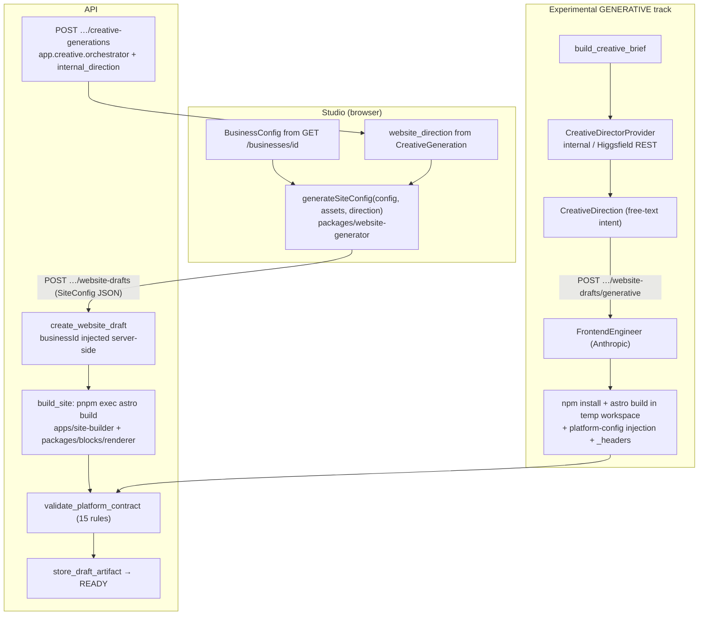
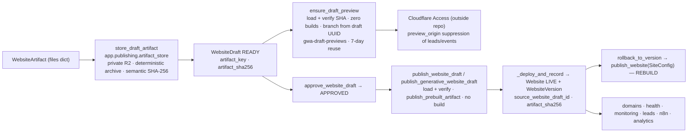

# v0.2 R0 — Architecture & Feature Preservation Audit

**Type:** read-only audit, 2026-09-29, on `main` @ `91ebd33` (after #57).
**Scope:** preparing the migration described in
[`v0.2-generative-website-architecture.md`](v0.2-generative-website-architecture.md).
Nothing was implemented, deployed or mutated. The only production reads were
Railway **variable names** (never values) for the API service. No paid
provider was called.

This report **supersedes the skeleton matrix** in the v0.2 architecture
document wherever the two disagree. Every correction below cites repository
evidence.

## Contents

1. [Executive summary](#1-executive-summary)
2. [The existing experimental generative engine](#2-the-existing-experimental-generative-engine)
3. [Current generation path (traced)](#3-current-generation-path-traced)
4. [Stable downstream lifecycle (traced)](#4-stable-downstream-lifecycle-traced)
5. [Feature Preservation Matrix (evidence-backed)](#5-feature-preservation-matrix-evidence-backed)
6. [High-risk couplings](#6-high-risk-couplings)
7. [Smallest viable architecture](#7-smallest-viable-architecture)
8. [WebsiteArtifact compatibility requirements](#8-websiteartifact-compatibility-requirements)
9. [Risk-ranked migration plan and gates](#9-risk-ranked-migration-plan-and-gates)
10. [Higgsfield assessment](#10-higgsfield-assessment)
11. [Recommended R1 slice](#11-recommended-r1-slice)
12. [Unresolved decisions](#12-unresolved-decisions)
13. [Corrections to the v0.2 architecture document](#13-corrections-to-the-v02-architecture-document)

## 1. Executive summary

- **A generative engine already exists and is wired end to end.**
  `app.creative.frontend_engine` (≈1.4k lines) has a `FrontendEngineer` ABC,
  an Anthropic implementation, a sandboxed file manifest, a dependency
  allowlist, an engine-authored Platform SDK, engine-authored legal pages,
  server-side `businessId` injection, and browser/Visual QA. GENERATIVE
  `WebsiteDraft`s already go through the **same** PlatformContract → stored
  artifact → real preview → approval → exact-byte publish lifecycle.
  v0.2 is therefore mostly *hardening and completing* this track, not
  building a second one.
- **Security finding (HIGH, live code path).** The generative build runs
  `npm install` (caret ranges, **no lockfile**) and `astro build` on
  **AI-authored** code with `env=dict(os.environ)` — the API process's full
  environment. In production that environment contains `ANTHROPIC_API_KEY`,
  `CLOUDFLARE_API_TOKEN`, `DATABASE_URL`, both R2 key pairs,
  `RESEND_API_KEY`, `SMTP_PASSWORD`, `HIGGSFIELD_API_KEY_SECRET` and
  `N8N_API_KEY` (verified by variable *name* only). There is no network egress
  restriction. Astro frontmatter executes as Node during the build, and any
  dependency lifecycle script runs during install. The docstring of
  `build._subprocess_env` claims otherwise. This violates v0.2 migration rule
  7 and needs a decision before any further generative work (see D1).
- **Rollback cannot handle generative versions.** `rollback_to_version`
  validates the stored `site_config` as `SiteConfigPayload` and **rebuilds**.
  GENERATIVE versions store a marker (`{"engine": "generative", …}`), so
  their rollback fails with an uncaught validation error (a 500). Legacy
  rollbacks rebuild with *today's* renderer, so they don't restore exact bytes.
- **PlatformContract v1 is already engine-agnostic** (15 rules). A separate
  "v2" is unnecessary; extend v1. **TruthContract does not exist**:
  generative factual safety is prompt-only, and nothing checks the output's
  claims or image origins.
- **Several planned abstractions already exist or are premature.**
  `CreativeDirectorProvider` exists (`app.creative.director`). The Platform
  SDK exists (`templates/platform_sdk.ts`). `CreativeDirection` (P2) is
  already a free-text blueprint. Wrapping the legacy generator in a Python
  `WebsiteBuilderProvider` is premature: the legacy SiteConfig is generated
  **in Studio (browser)**, and `WebsiteDraft.engine` is already the seam.
- **Verdict:** **R0_NEEDS_DECISIONS.** R1 (Business Truth) is scoped and
  ready, but D1 (the live secret-exposure path) must be decided first.

## 2. The existing experimental generative engine

| Component | File | What it does | Reuse? |
|---|---|---|---|
| `FrontendEngineer` ABC + `FrontendEngineResult` | `app/creative/frontend_engine/engine.py` | builder boundary: (BusinessConfig, CreativeDirection, assets, business_id, api_base_url) → WebsiteArtifact + provenance | **Reuse** as the builder abstraction |
| `AnthropicFrontendEngine` | `anthropic_engine.py`, `client.py`, `prompts.py` | one structured-output call (default `claude-opus-5`, 32k max tokens, 450 s timeout) → `GeneratedProjectManifest`; writes the workspace, builds, archives the source | **Reuse**, after hardening (§6.1) |
| `GeneratedProjectManifest` | `manifest.py` | files under `src/`/`public/` + requested dependency *names* only | **Reuse** |
| Workspace isolation | `workspace.py` | temp dir outside the repo; rejects traversal, absolute paths, dotfiles, `src/pages/api/`, reserved paths (`package.json`, `astro.config.mjs`, `tsconfig.json`, platform SDK) and non-allowlisted extensions | **Reuse**; file-level controls are sound |
| Dependency policy | `dependency_policy.py` | base `astro`/`typescript`; extra allowlist = `sharp` only; versions engine-pinned (caret ranges) | **Reuse**, add a lockfile |
| Scaffolding | `templates.py` | engine-authored `package.json`, `output: "static"`, strict tsconfig | **Reuse** |
| Build | `build.py` | `npm install` + `npm run build`; injects `platform-config` JSON after the build; computes CSP inline-script hashes; generates `_headers` via `security_headers.generate_headers_file` | **Reuse**; **fix env** (§6.1) |
| Platform SDK | `templates/platform_sdk.ts` | lead submit (honeypot/timing), analytics queue, consent (never preselected), WhatsApp URL, all read from injected config | **Reuse**; add parity tests vs site-builder (§6.2) |
| Legal pages | `legal_pages.py` | engine-authored `/privacy`, `/terms`, `/cookies` | **Reuse**, but reach parity with the legacy `legal.ts` (§6.5) |
| Browser QA / Visual QA | `browser_qa.py`, `visual_qa.py`, `app.publishing.drafts.run_visual_qa_for_draft` | Chromium pass on a READY draft, as a separate step | Reuse as an R9 benchmark signal |
| Availability | `availability.py`, `GET …/generative-pipeline-capability` | enabled when `ANTHROPIC_API_KEY` is set (it is in production) | Reuse |
| Draft integration | `app/publishing/drafts.py` `create_generative_website_draft`, `publish_generative_website_draft`; model `GenerativeWebsiteArtifact` | same state machine; PlatformContract gate; stored artifact; publish via `publish_prebuilt_artifact` with a generative config snapshot | **Reuse unchanged** |
| API route | `POST /businesses/{id}/website-drafts/generative` (`app/routers/creative.py`) | synchronous generate + install + build inside the request | Reuse; **add rate limit, budget and async execution** |
| Studio | `GenerativeWorkflowPanel.tsx` inside "Advanced creative tools" (`CreativeSection`) | operator-facing experimental workflow | Keep hidden; R8 rebuilds the UX |

**Tests today:** `test_frontend_engine_workspace.py` (11),
`test_frontend_engine_security.py` (3), `test_frontend_engine_build.py` (2,
real npm/astro), `test_frontend_engine_orchestration.py`,
`test_generative_website_api.py` (5, including the full create → approve →
publish lifecycle), `test_contrast_generative_output.py`,
`test_generative_pipeline_capability.py`, `test_frontend_engineer_availability.py`,
and `test_frontend_engine_real.py` (`real_provider`, excluded from CI).

**Not production-ready, because:**

- the build environment leaks secrets (§6.1);
- there's no lockfile;
- there's no egress control;
- generation runs synchronously inside the HTTP request (up to 450 s LLM + 180 s install + 120 s build);
- there's no rate limit or budget on the generative draft route (the director-develop route has both);
- there's no cost record for the frontend-engine call (only `StageTimer` logs and provider/model/duration on `GenerativeWebsiteArtifact`);
- factual safety is prompt-only;
- the legal pages are thinner than the legacy ones;
- the facts passed to the model are incomplete (§6.6).

## 3. Current generation path (traced)

Key facts:

- The **legacy SiteConfig is produced in Studio**
  (`PreviewStep` / `RedesignFlow` call `generateSiteConfig`) and POSTed. The
  server trusts its structure but overrides `businessId`
  (`create_website_draft` and `publish_website` both set
  `site_config.businessId`).
- `build_site` (`app/publishing/build.py`) runs `pnpm exec astro build` in the
  monorepo's `apps/site-builder`, with `SITE_CONFIG_PATH` and inherited env.
  That's trusted code with a frozen lockfile.
- Both engines converge on `validate_platform_contract(files, business_config)`
  and `_promote_with_stored_artifact`.

## 4. Stable downstream lifecycle (traced)

Failure recovery, verified in tests (`test_a8_build_once_promote.py`,
`test_a8_real_draft_preview.py`, `test_a8_4_first_site_artifact_promotion.py`,
`test_website_publish_service.py`):

- build, PlatformContract and storage failures give BUILD_FAILED with no artifact;
- a preview failure writes no metadata and leaves production untouched;
- a publish failure leaves the previous live `deploy_url` intact and the draft APPROVED;
- a business with no website stays without a live website.

**Rollback is the only downstream step that is not artifact-based** (§6.3).

## 5. Feature Preservation Matrix (evidence-backed)

Legend for **Coupling**: *none* means engine-independent; *SC* means coupled
to SiteConfig; *blocks* means implemented inside `packages/blocks` /
`apps/site-builder`; *dup* means already duplicated in the generative engine.

| # | Capability | Actual source (v0.1) | Tests | Coupling | v0.2 owner | Migration impact | Required regression gate |
|---|---|---|---|---|---|---|---|
| 1 | Authentication | `app/routers/auth.py`, `app/security/session_tokens.py`, `passwords.py` | `test_auth_api.py` | none | unchanged | none | existing suite |
| 2 | Authorization | `app/dependencies.py` `get_current_tenant_id`, `TenantAccess` | `test_a2_tenant_authorization_matrix.py` | none | unchanged | new routes must use the same deps | matrix test covers every new route |
| 3 | Tenant isolation | tenant-scoped repositories | `test_tenant_isolation.py` | none | unchanged + builder gets only its tenant's truth | builder inputs | isolation test for Business Truth |
| 4 | Business data | `BusinessConfig` (`app/domain/business_config`, `packages/business-config-types`) | many | SC (legacy consumes it in Studio) | Business Truth derived from it (R1) | additive | derivation tests |
| 5 | Business assets | `BusinessAsset`, `app/storage/r2.py` (public bucket) | `test_asset_upload_api.py` | none | Business Truth `assets` | additive | manifest tests |
| 6 | Asset provenance | `BusinessAsset.origin`/`generation_id`; `CreativeBriefAsset` | `test_creative_asset_validation.py` | none | Business Truth asset entries | additive | provenance tests |
| 7 | Logo preservation | legacy: `packages/website-generator/src/assets.ts`; generative: prompt lists asset URLs | website-generator tests | SC / prompt-only | TruthContract image-origin rule | **gap in generative** | seeded: external/missing logo fails |
| 8 | Real customer photos | same as 7 | same | SC / prompt-only | TruthContract image-origin rule | **gap in generative** | seeded: non-manifest `` fails |
| 9 | Claims integrity | legacy: generator emits only BusinessConfig facts (`generateSiteConfig.ts` header); `app/creative/factual_safety.py` constrains *creative briefs*; generative: prompt "FACTUAL SAFETY" only | `test_frontend_engine_security.py` (prompt framing) | prompt-only in generative | TruthContract (R5) | **gap in generative** | seeded fabricated phone/price/years fail |
| 10 | Reviews integrity | reviews stored/toggled via `app/routers/creative.py` `/reviews` (+visibility); **not rendered** by the legacy generator (no testimonials emitted); generative prompt forbids reviews | reviews API tests | none (not on sites) | Business Truth `reviews` (visible only) when rendering is added | **correction:** no site rendering exists today | TruthContract: testimonial markup only from visible reviews |
| 11 | Lead forms | legacy: `packages/blocks/.../Contact.astro` (`data-gwa-lead-form`), `apps/site-builder/src/components/LeadSubmission.astro`, `lib/leadPayload.ts`; generative: SDK `submitLead`; server `POST /public/businesses/{id}/leads` | `test_public_leads_api.py`, `test_lead_capture_e2e.py`, PlatformContract rules | blocks + dup | Platform SDK | parity risk | PlatformContract `missing_lead_form`/`disconnected_lead_form` + SDK parity test |
| 12 | Email | `app/notifications` (Resend), after lead persistence | A4 tests | none | unchanged | none | existing |
| 13 | n8n | `app/automation/n8n` dispatch after persistence | `test_lead_automation_dispatch.py` | none | unchanged | none | existing |
| 14 | WhatsApp | legacy: `packages/site-config/src/whatsapp.ts`, `Contact.astro`, `apps/site-builder/src/components/WhatsAppFloatingButton.astro`; generative: SDK `getWhatsAppUrl` | PlatformContract `missing_whatsapp_link` | blocks + dup | Platform SDK | parity risk | contract rule + number-matches-truth check |
| 15 | Analytics | legacy `Analytics.astro`; generative SDK queue; server `POST /public/businesses/{id}/events` | `test_public_analytics_api.py`, contract rules | blocks + dup | Platform SDK | parity risk | `missing_analytics_beacon` + SDK parity |
| 16 | Consent | legacy `CookieConsentBanner.astro`/`Layout.astro`; generative SDK `getConsent`/`setConsent` + an AI-authored banner UI | contract `missing_consent_mechanism`; `docs/legal-and-consent.md` | blocks + dup (UI is AI-authored in generative) | Platform SDK (+ engine-authored banner, see D6) | **risk:** banner UI quality depends on the model | contract rule + E2E consent-gates-analytics |
| 17 | SEO | title/description/viewport (`packages/site-config/src/seo.ts`); **robots.txt / sitemap not implemented** (seo.ts defers them) | contract `missing_seo_*` | SC / AI-authored | Platform Adapter | **correction:** robots/sitemap are not an existing capability | contract rules |
| 18 | Legal | legacy `packages/website-generator/src/legal.ts` (uses `legal_profile`: legal name, registered address, privacy email); generative `legal_pages.py` (name + contact email only) | `legal.test.ts`, contract `missing_legal_page` | SC + dup | engine-authored pages from Business Truth `legal` | **generative regression** (no legal name/address) | parity test legacy vs generative legal content |
| 19 | Domains | `app/publishing/domains.py`, `domain_provider.py` | `test_custom_domain_*` | none | unchanged | none | existing |
| 20 | Health/readiness | `app/routers/website_health.py`, `app/publishing/readiness.py` | `test_website_health_api.py` | none | unchanged | none | existing |
| 21 | Monitoring | `app/monitoring` (A6.1) | `test_a6_1_monitoring_alerting.py`, `test_monitoring_checks.py` | none | unchanged | none | existing |
| 22 | WebsiteDraft | `app/publishing/drafts.py` (engine enum) | `test_website_draft_*`, A8 tests | none | unchanged | none | existing |
| 23 | Artifact storage | `app/publishing/artifact_store.py`, `app/storage/private.py` | `test_a8_build_once_promote.py` | none | unchanged | none | existing |
| 24 | Artifact SHA | `artifact_sha256`, verify on load | same | none | unchanged | none | existing |
| 25 | Real Preview | `ensure_draft_preview`, `CloudflarePagesPreviewPublisher` | `test_a8_real_draft_preview.py` | none | unchanged | none | existing |
| 26 | Access protection | Cloudflare Access (outside repo) | manual | none | unchanged | none | manual 302 check |
| 27 | Preview suppression | `app/security/preview_origin.py` | A8 preview tests | none | unchanged | none | existing |
| 28 | Approval | `approve_website_draft` | A8 tests | none | unchanged | none | existing |
| 29 | Publish | `publish_website_draft` / `publish_generative_website_draft` → `publish_prebuilt_artifact` | A8 + `test_generative_website_api.py` | none | unchanged | none | byte-identity tests |
| 30 | WebsiteVersion | `_deploy_and_record` | `test_website_versions_*` | config snapshot is SC or a generative marker | unchanged | none | existing |
| 31 | Rollback | `app/publishing/versions.py` `rollback_to_version` → `publish_website` | `test_website_versions_*` (SiteConfig only) | **SC** | artifact-based rollback | **blocking for generative** | rollback of a generative version restores exact bytes |
| 32 | Failure safety | draft/publish error handling | A8 tests | none | unchanged | **new:** async generation failures | failure tests for the async job |
| 33 | Provider tracking | `CreativeGeneration.provider`; `GenerativeWebsiteArtifact.generator_provider/model`; `app.creative.observability` | orchestration tests | none | unchanged | none | existing |
| 34 | Cost tracking | `CreativeGeneration.credits_used/estimated_cost`; director budget (`BudgetExceededError`); rate limit on develop only | A3.1 tests | none | **gap:** frontend-engine calls have no rate limit, budget or cost record | add | rate-limit + budget tests on the generative route |

## 6. High-risk couplings

### 6.1 Build environment exposes platform secrets — HIGH

- `app/creative/frontend_engine/build.py` `_subprocess_env()` returns
  `dict(os.environ)` for `npm install` and `npm run build`.
- The Railway API service's variable names include `ANTHROPIC_API_KEY`,
  `CLOUDFLARE_API_TOKEN`, `DATABASE_URL`, `R2_*` (public and private),
  `RESEND_API_KEY`, `SMTP_PASSWORD`, `HIGGSFIELD_API_KEY_SECRET`,
  `N8N_API_KEY` and `INTERNAL_AUTOMATION_TOKEN`.
- **Vectors:**
  1. AI-authored `.astro` frontmatter runs in Node at build time, and could
     read `process.env` and send it anywhere (no egress control). That needs a
     prompt injection through business text, asset URLs or direction text
     reaching the model; `test_frontend_engine_security.py` covers only the
     prompt framing.
  2. `npm install` without a lockfile resolves floating transitive versions of
     `astro`/`sharp`; any compromised package's install script runs with those
     secrets. No prompt injection is needed.
- **Required before more generative work:**
  - run the build with an allowlisted env (`PATH`, `HOME`, npm cache, `NODE_ENV`);
  - use a committed lockfile or `npm ci` against a vetted lock;
  - then move to a separate worker or container with no platform secrets and restricted egress (R6).
- **Decision D1:** should the live generative route be disabled (or the env
  scrubbed) now, in a small security PR, before R1?

### 6.2 Platform capabilities duplicated between renderer and SDK

- Lead, analytics, consent and WhatsApp logic live in `apps/site-builder`
  (legacy) and are **copied** into `templates/platform_sdk.ts` (whose own
  header says it mirrors them).
- Two implementations can drift: event names, payload shape, honeypot/timing
  fields, consent key.
- **Recommendation:** add SDK↔site-builder parity tests (same endpoints, event
  names, consent key, payload) before any SDK change. Extract a shared package
  only if parity tests show it's worth it.

### 6.3 Rollback rebuilds from SiteConfig — HIGH for generative

- `rollback_to_version` → `SiteConfigPayload.model_validate(version.site_config)`
  → `publish_website` (a rebuild, without the PlatformContract gate).
- For GENERATIVE versions, `site_config` is the generative marker, so
  validation fails with a pydantic `ValidationError`. The route catches only
  `WebsitePublishError`, so the result is a 500.
- For legacy versions the rebuild uses today's renderer, so it's not
  exact-byte.
- Everything needed for artifact rollback already exists: `WebsiteVersion`
  has `source_website_draft_id` and `artifact_sha256`, and the draft keeps
  `artifact_key` in private storage.
- **Fix:** try the artifact first (load via the source draft, verify SHA,
  `publish_prebuilt_artifact`), and keep the SiteConfig rebuild only for
  pre-A8.3.4.1 versions. Refuse cleanly (409) when neither is available.
- This must land **before** any generative site goes live.

### 6.4 Server-side `businessId` injection

- Legacy: `create_website_draft` / `publish_website` set
  `site_config.businessId`.
- Generative: `build._inject_platform_config` inserts a JSON `platform-config`
  tag into every HTML file after the build, and the SDK reads only that.
- Both are server-authoritative. **No coupling risk**; keep both.

### 6.5 Legal pages

- The legacy `legal.ts` uses `legal_profile` (legal name, registered address,
  privacy contact email).
- The generative `legal_pages.py` uses only the business name and contact
  email.
- **Regression for generative:** derive both from Business Truth `legal` (R1),
  and have the generative engine render the same content.

### 6.6 Facts given to the model are incomplete

- `prompts._business_facts` passes only name, industry, description, target
  customers, service *names*, WhatsApp and asset URLs.
- It omits contact phone/email/address, service areas, opening hours, legal
  details and visible reviews.
- Generative sites therefore under-state facts. That's safe, but weak.
- Business Truth (R1) should become the single fact serializer for the prompt
  and for TruthContract.

### 6.7 WhatsApp, robots/sitemap, claims, reviews

Covered in matrix rows 9, 10, 14 and 17, including the two corrections:
robots/sitemap aren't implemented, and reviews aren't rendered on sites today.

## 7. Smallest viable architecture

| Proposed abstraction | Verdict | Reason (evidence) |
|---|---|---|
| **BusinessTruth** | **Necessary (R1)** | no single fact source today: legacy reads BusinessConfig in TS, generative hand-serializes a subset (§6.6), and TruthContract needs a machine-checkable source |
| **AssetManifest** | Part of BusinessTruth, not separate | assets are already typed (`CreativeBriefAsset`, `BusinessAsset`); one `assets` section with id/kind/category/url/origin is enough |
| **CreativeBlueprint v2** | **Premature** | `CreativeDirection` (P2, `app/domain/creative/direction.py`) is already free-text design intent with concept, visual language, experience and content strategy; revisit only if R9 shows it limits quality |
| **CreativeDirectorProvider** | **Exists** | `app/creative/director.py` ABC; internal, fallback and Higgsfield REST implementations; orchestrator with budget |
| **WebsiteBuilderProvider** | **Partly premature** | the generative side already has `FrontendEngineer`; the legacy SiteConfig is produced in Studio, so a Python wrapper adds indirection with no caller; `WebsiteDraft.engine` is the real seam |
| **Platform SDK** | **Exists** | `templates/platform_sdk.ts`; add parity tests (§6.2) |
| **PlatformContract v2** | **Unnecessary as a separate contract** | v1 is engine-agnostic (15 rules); extend v1 with a version bump (asset-origin rule, WhatsApp number equals truth) |
| **TruthContract** | **Necessary (R5)** | nothing verifies generative claims or images; start deterministic (image origin, phone/email/WhatsApp values, testimonial markup, price/years patterns as advisory) and add model-assisted checks later |
| **Isolated generation workspace** | **Exists, needs hardening** | file controls are sound; env, lockfile, egress and in-request execution are not (§6.1) |

## 8. WebsiteArtifact compatibility requirements

For any builder's output to use the unchanged downstream path, it must:

1. be a `WebsiteArtifact(files: dict[str, bytes], entry_point="index.html")`
   containing `index.html`;
2. carry platform-generated `_headers` from
   `security_headers.generate_headers_file`, with CSP inline-script hashes and
   `connect-src` including the public API origin
   (PlatformContract `public_api_csp_disconnected`);
3. have server-injected tenant identity: SiteConfig `businessId` (legacy) or
   the `platform-config` JSON tag (generative); never builder-authored;
4. include legal pages at `/privacy`, `/terms` and `/cookies`, and a consent
   mechanism gating analytics;
5. pass `validate_platform_contract(files, business_config)` with no
   BLOCKING violations before storage;
6. be stored only through `store_draft_artifact` (deterministic archive,
   semantic SHA-256) and never be modified afterwards;
7. be fully static: no server endpoints (`src/pages/api/` is rejected), because
   the publisher and preview deploy static files to Cloudflare Pages;
8. record a `WebsiteVersion.site_config` snapshot: SiteConfig (legacy) or the
   generative marker. Rollback must not depend on it after §6.3;
9. make only relative or allowlisted requests: the lead and event endpoints on
   the public API, so preview suppression by `Origin` keeps working
   unchanged.

Domains, monitoring, health, leads, n8n and analytics depend only on the
deployed site and the public endpoints, so they need no change if 1–9 hold.

## 9. Risk-ranked migration plan and gates

Ordered by risk × dependency. Legacy/BASIC stays the default and fallback
throughout, and every phase except G4 has no production-visible change.

| Order | Work | Risk addressed | Gate to pass | Production change |
|---|---|---|---|---|
| **S0** | Security PR: env allowlist for generative install/build, lockfile or `npm ci`; optionally hide the route (D1) | secret exposure (HIGH) | test proves no platform secret is in the subprocess env; build still passes | yes, hardening only |
| **S1** | Artifact-based rollback, SiteConfig rebuild only for legacy versions | generative rollback 500; non-exact rollback | rollback of legacy and generative versions restores the exact stored bytes; clean 409 when unavailable | yes, rollback path |
| **R1** | Business Truth (with assets and legal) | fact drift; weak prompt facts | deterministic derivation; used by the generative prompt and legal pages; legacy unchanged | no user-visible change (generative-only) |
| **R4′** | SDK parity tests plus the legal-page parity fix | capability drift | parity suite green | no |
| **R5** | Extend PlatformContract v1 and add a deterministic TruthContract | fabricated claims or images | seeded-violation suite: 100 % caught, 0 false positives on fixtures | no (generative gate only) |
| **R6** | Generation off the request path (worker/job), no platform secrets, egress allowlist, rate limit, budget, cost record | cost, timeouts, isolation | job tests; budget and rate-limit tests; cost row per call | no |
| **R7/R8** | Generative draft via job + Studio UX behind a flag | UX / cost surprises | tests under the frontend network guard; flag off by default | flagged only |
| **R9** | Shadow benchmark vs legacy on fixture and real businesses | quality | owner-judged differentiation; 0 truth violations; contract pass rate ≥ target; cost/latency within budget | no |
| **G4 / R10** | Pilot | real-world | preservation matrix gates all green on pilot sites | pilot only |

**Rollback strategy for enabling the new generator:**

- Generative selection is a per-business flag (default legacy).
- Disabling it returns to the legacy path immediately.
- Already-published generative sites stay live and can be rolled back to any
  prior version by artifact (S1).
- No migration is needed to revert, because both engines share `WebsiteDraft`
  and `WebsiteVersion`.

**Provider-cost safeguards:**

- rate limit and per-tenant budget on the generative route (reuse the
  director's `CreativeBudget` / `BudgetExceededError` pattern);
- a cost row per frontend-engine call;
- default model configurable;
- no automatic retries that re-bill;
- the benchmark (R9) runs on an explicit, capped budget.

## 10. Higgsfield assessment

- **In the repository today,** Higgsfield has three documented paths
  (`docs/higgsfield-integration.md`):
  - the production **REST Creative Director**, which produces
    `CreativeDirection`s and concept images;
  - a local-only CLI director;
  - an unfinished legacy provider that always raises
    `HiggsfieldNotIntegratedError`.
- **Website code generation is done by Anthropic** (`AnthropicFrontendEngine`),
  not Higgsfield. The frontend prompt explicitly treats Higgsfield images as
  *inspiration only, never embedded*.
- **Conclusion:** Higgsfield is **not necessary** for the proposed pipeline.
  Keep it as one optional `CreativeDirectorProvider` for visual direction and
  concept imagery. The internal director and fallback already exist, so the
  pipeline runs without it.
- **Unknown (unverified externally):** whether Higgsfield offers anything
  beyond image/direction generation that would matter here, such as layout or
  code. It isn't integrated or documented in this repository, and no provider
  was called.

## 11. Recommended R1 slice

**Goal:** a provider-independent, deterministic **Business Truth** (with assets
and legal) used by the generative engine. The legacy path stays untouched.

**Likely files:**
- new `apps/api/app/domain/business_truth.py`: pydantic `BusinessTruth` with
  `identity`, `contact`, `services`, `service_areas`, `hours` (if modeled),
  `whatsapp`, `legal`, `reviews` (visible only), `assets` (id, kind,
  category, url, origin), and a `version`;
- new `derive_business_truth(business_config, assets, reviews)`: pure and
  deterministic;
- `apps/api/app/creative/frontend_engine/prompts.py`: `_business_facts`
  serializes `BusinessTruth` (fuller facts, same safety framing);
- `apps/api/app/creative/frontend_engine/legal_pages.py`: render from
  `BusinessTruth.legal`, reaching parity with the legacy `legal.ts` fields;
- `apps/api/app/routers/creative.py`: the generative route builds `BusinessTruth` once;
- tests: new `tests/test_business_truth.py`; update the generative prompt and legal tests.

**Acceptance criteria:**
- the same inputs produce the same `BusinessTruth` (deterministic, stable ordering);
- only visible reviews appear, and hidden ones are excluded;
- assets carry stable id and provenance;
- tenant-scoped;
- no BusinessConfig field is invented;
- the generative prompt contains every truth fact and nothing else;
- generative legal pages include the legal name, registered address and
  privacy contact when present, and "not provided" otherwise;
- no change to legacy output, SiteConfig, schema or migrations; full suites green.

**Out of scope for R1:** TruthContract, SDK changes, rollback, async jobs, Studio.

## 12. Unresolved decisions

| ID | Decision | Options | Recommendation |
|---|---|---|---|
| **D1** | Live generative build exposes platform secrets (§6.1) | (a) small security PR now: env allowlist + lockfile; (b) also hide/disable the route until R6; (c) defer | **(a) now, and (b) until R6**. It must precede R1. |
| D2 | Rollback strategy (§6.3) | artifact-first with legacy fallback vs. keep rebuild | artifact-first (S1) before any generative go-live |
| D3 | Execution model for generation | in-request (today) vs. background job/worker | background job with its own env (R6) |
| D4 | Model/provider for the frontend engine | keep Anthropic `claude-opus-5` default vs. configurable per tier | keep the ABC; make the model a setting with cost caps |
| D5 | Reviews on sites | keep off vs. render visible reviews via Business Truth | keep off until TruthContract exists |
| D6 | Consent banner UI | AI-authored (today) vs. engine-authored component | engine-authored banner the AI can only style (compliance) |
| D7 | robots.txt / sitemap | not implemented today | treat as new SEO work, not preservation |
| D8 | Whether to wrap the legacy generator as a `WebsiteBuilderProvider` | wrap vs. keep `WebsiteDraft.engine` as the seam | keep the seam; don't wrap |

## 13. Corrections to the v0.2 architecture document

- `CreativeDirectorProvider` and the Platform SDK **already exist**; they
  aren't new abstractions.
- "PlatformContract v2" should be **an extension of v1**, since v1 is already
  engine-agnostic.
- CreativeBlueprint v2 and a Python `WebsiteBuilderProvider` wrapping the
  legacy generator are **premature**.
- Reviews are **not rendered** on sites today, and robots/sitemap are **not
  implemented**. Neither is a preservation item.
- R1's exit criterion "the legacy path can be fed from Business Truth with
  byte-identical output" is unnecessary for the smallest viable R1. Business
  Truth serves the generative path and TruthContract first.
- Two items belong **before R1**, because they affect production safety and
  generative rollback: the security hardening (S0) and artifact-based rollback
  (S1).
